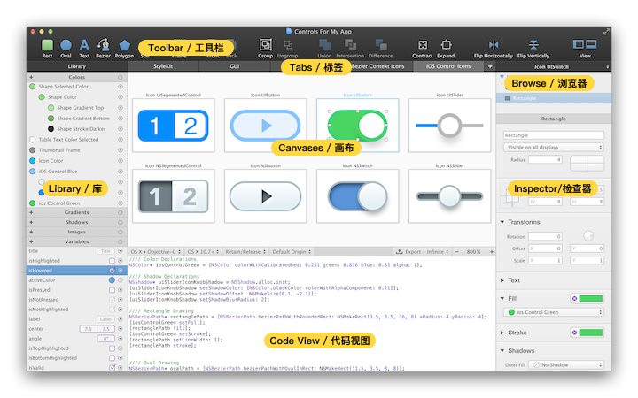
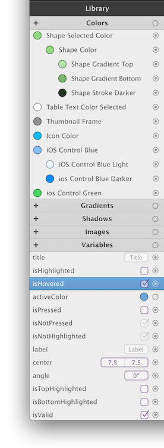
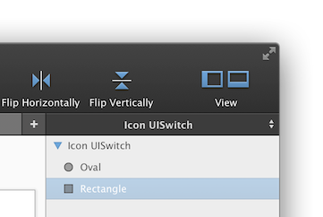

# 概述

PaintCode 是一个可以将你的绘图，实时转换成 Objective-C、 Swift 和 C# 代码的矢量绘图软件。它的应用程序窗口被划分成了 4 个部分，便于快速地找到你需要的所有功能。

## 工具栏

窗口顶部的工具栏包含了你会最经常用到的绘图工具。

## 标签页和 StyleKit

标签页位于工具栏下方的中间位置。你可以使用标签页来管理你 Paintcode 文件中的绘图。每个标签页都可以包含多个绘图画布。

第一个标签页叫 `StyleKit`，它比较特殊，你可以在这里找到你的 Stylekit 分类 —— 一个绘图、颜色、渐变和其他设计资源的集合，你可以直接把它导出成一个单独的 Objective-C、 Swift 或 C# 类。Stylekit 让你轻松地将生成的代码集成到你的项目中去。

## 库

库（窗口左侧）是所有颜色、渐变、阴影、图片和变量的集合。库里边所有的项都可以在文件中重复使用。这些项在 PaintCode 中是独立的实体，当你在库中改变它们的时候，所有使用到它们的绘图都会受影响而立即改变。

> Tovi注：库项，英文为 library item。指的是窗口左侧的 库 中那些颜色、渐变等元素。因为这个词汇在文档的后面也会提到多次，但是在中文中我并没有听过 库项 这个词，所以还是有些迟疑的。不管怎么说，在没找到更好的翻译之前，先用着 库项 这个翻译。

## 画布

PaintCode 软件窗口的中间部分包含了当前选中的标签页的内容。通常，你会在这个区域看到一个或多个绘图画布。

## 代码视图和中间工具栏

你可以在中间的工具栏那里更改代码生成设置（比如更改生成代码的目标语言和操作系统版本）。同时，你也可以在这里更改画布的显示设置，如缩放和像素密度（视网膜屏、非视网膜屏或无限模式）。

在这个工具栏的下方是代码视图，包含了生成的代码。你可以通过向下拖动中间工具栏来隐藏代码视图，这样你就可以有更多的空间来显示你的绘图画布，而且当在处理比较复杂的文件的时候，还可以通过这种方式来优化软件性能。

## 形状和组浏览器

形状和组浏览器位于窗口的的右上方，就在工具栏的下面。这是当前选中画布中所有 **图形** 的列表。你会发现画布也本身位于这个列表的根目录里。当你选中一个画布时，针对它的设置会出现在下侧的检查器里。

## 检查器

检查器在窗口的右边。你可以在这里更改所选对象的属性，通常就是指画布里的图形。

