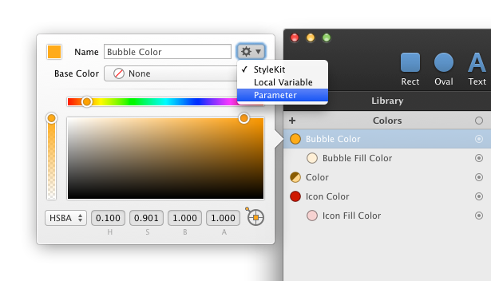

# 核心概念

**库**是你创建和管理颜色、渐变、阴影、图片和变量的地方。这些库项的**行为**是为 UI 设计的需要专门设计的。

举个例子，你可以在多个图形中使用相同的颜色，之后如果你调整这个颜色，所有使用到它的形状都会自动更新颜色。渐变、阴影、图片和变量也是一样的道理。

这个功能非常有用，因为你可以很轻松地在一个地方调整你在设计的界面的配色方案。

此外，一些库项之间还可以形成关联。比如，你只需要通过 **内置颜色运算**，就可以从现有颜色衍生出新的颜色。渐变和阴影也可以通过从库里的颜色衍生得到。表达式变量可以引用其他的库项。

> Tovi注： 内置颜色运算 原文 the built-in operations。PaintCode 内置的一个功能，它可以在基础色的基础上，通过改变透明度、色相、饱和度等来生成一个衍生色。后面还会出现这个词。

利用这个功能，你可以定义一个依赖于单个或多个基础色的颜色、渐变和阴影家族树。当你调整这个基础色时，所有直接或间接依赖于它的**库项**和**形状**都会自动更新：

假设你正在设计一组颜色丰富的 UI 控件，你可以从一个基础色中衍生出所有需要的颜色、渐变和阴影。之后，再通过调整这个基础色，你就可以轻松地改变整个文件的配色方案。

## 命名

每个库项都有一个名字。PaintCode 会为你生成这些名字，不过你可以（可能也应该）为你的库项提供你自己的、更具有描述性的名字。这些名字在生成代码时会用到。你可以在名字中使用空格 —— PaintCode 在生成的代码中会自动将 `'Button Base Color'` 转换成 `'buttonBaseColor'`， 它还不允许你使用生成代码中的保留名字，所以你不必担心生成的代码中任何潜在的命名冲突。

> Tovi注：这也是 Paintcode 可以导出高质量的代码的原因之一。严格的命名不冲突。

你可以通过双击一个库项来调出它的编辑弹框，来给它重命名。

## 使用库

**库**被分成了五个部分：颜色、渐变、阴影、图片和变量。要新建一个库项（比如颜色），你可以通过点击相应库项库项顶部的 '+' 按钮。

要删除一个库项，从列表中找到并单击它，然后按 `Delete` 或 `Backspace` 键。而要调整某个已经存在的库项，在列表中找到并双击它就可以了。或者，你可以在检查器中单击 已经调用库项的 **按钮槽** 来显示编辑弹框。

## 复制与粘贴行为

当你在不同 PaintCode 文件之间复制和粘贴**形状**时，所有必须的颜色、渐变、阴影和图片也会自动复制到目标文件中。如果目标文件中本身包含这些项，则会复用这些项。

## 将库项配置为参数

每个库项的**名字输入框**右边都有个特殊的**弹出按钮**（就是那个有齿轮图标的按钮）。

你可以在这里配置**库项的行为**，这无论是对于 [代码生成](./Part.5.stylekits&code_generation.A.code_generation.md) 还是对于使用 [Symbol](./Part.9.using_symbols.md) 都非常重要。

通过在**弹出按钮**中将行为更改为 'Parameter'，你可以确保每一个使用到这个库项的画布生成的**绘方法**，都有一个对应于该特定库项的参数。例如，这允许你创建一个在运行时使用指定颜色来绘制图标的**绘方法**。

如果你选择 'StyleKit' 行为，这个库项将被自动添加到你的 [StyleKit](./Part.5.stylekits&code_generation.A.code_generation.md) 里。
