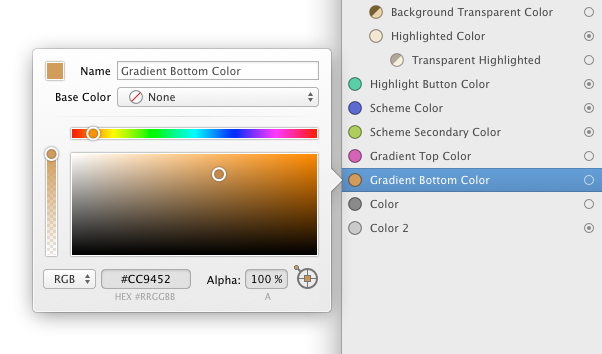

# 颜色

PaintCode 里有 3 种类型的颜色：

- 系统色
- 基础色（自定义）
- 衍生色（自定义）

系统色有黑色、白色、透明、红色、绿色、蓝色和几种深浅不一的灰色。你不能定义新的系统色，而且它们不会显示在库中。不过，你可以在库中创建你自己的颜色，它们可以是基本色和衍生色。

## 基础色

基础色是一个不依赖于任何其他颜色的简单颜色。你可以随时调整它，任何或直接或间接与它相关的图形或者库项（渐变、阴影……）都会相应地更新。

## 衍生色

[视频](https://youtu.be/-WQNE_xyHNg)

衍生色是动态依赖于其他颜色的颜色。它是通过使用一些 **内置颜色运算** 从父级颜色中衍生出来：

- 改变透明度
- 改变色相
- 改变明度
- 改变饱和度
- 应用阴影
- 应用高粱
- 拷贝

当父颜色改变了，所有直接和间接的（通过其他颜色）衍生色都将自动更新。库中显示的颜色以层级树形式排列 —— 衍生色是基础色的子颜色。

## 使用颜色

有三种方式可以在你的 **图形** 中设置颜色。

第一种，你可以通过 **拖拽** 链接点到一个画板的图形中，然后选择一个你想要与该颜色链接的属性。链接点的位置是在库中颜色的旁边。如果一个颜色没有实际在文件中使用到，取而代之的是一个空心圆。

另一种使用颜色的方式是使用检查器里的 **Stroke** 或 **Fill** 按钮槽。当按钮槽是空的时候，意味着它的属性（描边或填充）还未被设置。当你点击按钮槽，会出现一个菜单来供你选择你想要使用的颜色。这个菜单里同步了库里边的项，在它的顶部还有系统色可以选择。

顺便一提，当你不想在图形中使用这个颜色的时候，只需要点击 按钮槽 左侧的紫色圆形 `'x'`。

第三种使用颜色的方式是在 颜色弹出按钮菜单 中选择它。

上面的三种设置颜色的方式效果是一样的 —— 你选择你觉得最方便的那个就好。

## 添加新颜色

有几种添加新颜色的方式：

- 点击库里颜色列表的最上边的 `'+'` 按钮
- 点击 颜色弹出菜单 上的 `'Add new color...'` 选项。这种方式会在这个弹出按钮中使用这个新创建的颜色。
- 按住`'⌘'` 即 `'Command'`，并单击检查器里的已经设置好颜色的按钮槽。通过这种方式可以在库中复制一份这个颜色。

当你在库中添加一个颜色，会出现一个颜色编辑弹窗。（需要注意的是，你也可以通过从别的文件复制粘贴的带颜色的图形的方式来添加颜色，还可以通过双击一个[渐变]()控件来添加）。

## 编辑颜色

你可以在库里边双击一个颜色来编辑它。或者你可以在检查器中点击一个按钮槽来显示颜色编辑弹窗。

文字输入框里的是颜色的名字。PaintCode 会为你生成所有的颜色名，不过你可以随时重新命名让它们更具描述性。

有两种类型的颜色：“基础的” 和 “衍生的”。 基础色是 `'Base Color '` 设置为 `'None'` 的颜色。对于基础色，你只需要在颜色选择器里选择一个特定的颜色。你可以用不同颜色格式设置精确的值，调整颜色球，或者使用弹窗右下角的取色器来吸取屏幕上的任意颜色。

通过设置 `'Base Color'` 你就能得到一个 “衍生的色”。对于衍生色，你需要为它进一步设置你想要的 **运算** 和 **数值**。例如，你可以将颜色设置为与库中已有的颜色相同，但不透明度设为 50%。这是一个极其有用的功能。

衍生色会随着它的父颜色的改变而自动更新。

## 删除颜色

当你试图删除一个已经在你的图形里使用的颜色时，会弹出一个确认删除表，它会告知你如果你删除这个颜色，哪些形状和哪些库项会受到影响。

当你删除一个颜色时，在所有使用到它的形状、渐变、阴影和变量里会被替换成默认的红色。所有直接衍生自被删除色会转成基础色，但在视觉上会保持不变。

## 使颜色在生成代码和 Symbol 中表现为参数

要了解更多关于如何配置颜色和其他库项为参数，请阅读“[库项行为]()”。
