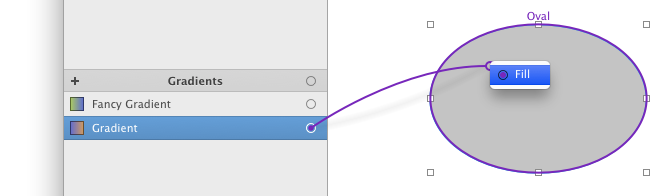

# 渐变

渐变可被用作填充矩形、 圆角矩形、椭圆形、Bezier、星形和多边形。 PaintCode 支持多段渐变。你还可以在**线性渐变**（由角度或两个点定义的渐变）和**圆形渐变**之间进行选择。渐变依赖于它所使用的颜色，当这些颜色修改了，这些渐变也会随之改变。

## 使用渐变

要使用一个渐变，**拖拽**它的连接点到画布里的一个形状中：

或者，你可以点击检查器里的空的 `'Stroke'` 或 `'Fill'` 按钮槽，并在菜单里选择一个渐变。

再或者，在 `'Fill'` 弹出按钮菜单里选择渐变：

这个菜单自动同步了库里的颜色和渐变。

## 新增渐变

有两种基本的新增渐变的方式：

- 点击库里渐变列表最上边的 `'+'` 按钮
- 点击 `'Fill'` 弹出菜单 上的 `'Add new gradient...'` 选项。这种方式会使用新创建的渐变作为填充。

注意：你也可以通过复制粘贴其它文件里使用了渐变的形状来添加渐变。

## 编辑渐变

你可以在库中双击一个的渐变来编辑它。

或者你可以单击检查器里的使用了渐变的按钮槽来显示颜色编辑弹框。

文字输入框里的是渐变的名字。虽然 PaintCode 会帮你生成名字，但是你随时可以改一个更具描述性的名字。

这个弹窗里有一个特殊的**渐变控件**。你可以用它来指定各个颜色在渐变里的位置。

## 改变渐变的色值

要改变渐变里的颜色，选中**渐变控件**里的一个颜色球，然后，在下方的颜色弹出按钮里选择一个想要的颜色。

## 在渐变弹框里方便地调整颜色值

有时，你会需要调整渐变里颜色的深浅。虽然你可以关闭渐变弹框，然后打开颜色弹框来调整颜色，但是那很不方便。你可以直接在渐变弹框里的，颜色弹出按钮右边的**颜色按钮槽**来调整一个基础色。

## 在渐变弹窗直接新增一个颜色

如果你试图在渐变弹窗里的颜色按钮槽里，调整的颜色不是一个基础色（比如是一个系统色或衍生色），那么就会自动创建一个基础色来使用。

## 调整渐变的颜色位置

要调整渐变里的一个颜色的位置，只需要拖动颜色球到指定位置。如果想要将颜色球拖动到预设的位置，按住 `'Shift'` 来拖动。预设位置由一些刻度表示。

或者，你可以使用键盘上的左右方向键来微调颜色球的位置。

## 调整颜色间的线性度

可以通过拖动渐变控件顶部的**菱形按钮**来调整两个相邻颜色间的渐变度。

## 给渐变添加更多的颜色

你可以在渐变控件里的指定位置上双击来给渐变添加更多的颜色。默认会添加一个黑色，不过你可以按照前面说的方法很容易就可以替换它（在弹出按钮中选一个其他颜色），或者之后再来替换。

## 移除渐变里的颜色

要移除渐变里的颜色，你只需要选中渐变控件里相应的颜色球，然后按 `'Delete'` 键。需要注意的是，这仅仅会从渐变中删除颜色，而不是从库中。

## 绘制线性渐变

当你在检查器里的**填充弹出按钮**选了一个渐变色，你可以选择渐变 `'Angle'` 选项（调整渐变角度）。

要调整一个渐变的角度，你可以在文字输入框里直接输入角度，或者使用圆形滑动控件。默认情况下，控件滑动的角度是45的倍数，不过你可以在拖动时按住 `'Option'` 键来使拖动变得顺滑。

![两点渐变]](./images/twopoint_gradient.png)

如果你想要手动选择指定的渐变起止点，你可以选择渐变的 `'2 Points'` 选项，画布中的形状上就会出现一个两个点的渐变编辑 UI。每当你选择一个带 `'2 Points'` 选项打开的形状，同时 `'Fill'` 检查器框打开时，这个渐变UI就会出现。

## 绘制圆形渐变

你需要选择 `'Cirular'` 选项来打开圆形渐变。

![圆形渐变]](./images/circular_gradient.png)

当你打开这个选项时，一个**圆形渐变编辑UI**就会自动出现在画布中。每当你选择一个带圆形渐变的形状时这个UI就会出现。它包含了两个圆，每个分别代表圆形渐变的一个端点。

你可以随意拖动任意一个圆形的中点来移动到新的位置。另外，你还可以调整圆形的大小，只需在选中圆形边上任意位置并拖动即可。

默认情况下，两个圆的中心和直径都会吸附到编辑后的形状的边缘。要抑制这种情况，需要按住 `'Control'` 键。
