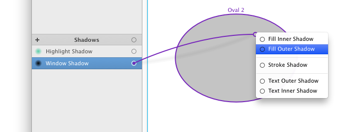
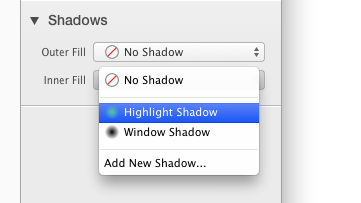
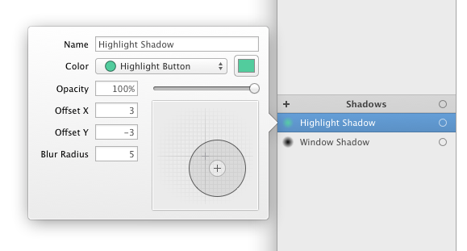

# [阴影](_cover.md)

PaintCode 支持填充、描边和文字的阴影。对于填充和文字，还支持内阴影。这两个功能都非常有助于在你的绘图里模拟光影。阴影由它所使用的颜色决定，衍生的阴影会随着这个的颜色的改变而更新。

## 使用阴影

要使用一个阴影，**拖拽** 它的连接点到一个画板的形状中：

或者，你可以在检查器的**阴影弹出按钮**里选择一个阴影。

这个菜单自动同步了 库中的阴影。需要注意的是 `'Fill'` 和 `'Stroke'` 阴影是分开设置的。填充和文字还支持设置内阴影。

## 添加新阴影

有两种基本的新增阴影的方式：

- 点击库里阴影列表的最上边的 `'+'` 按钮
- 点击 阴影弹出按钮菜单 上的 `'Add new shadow...'` 选项。这种方式会使用新创建的阴影。

当添加了一个新的阴影，会出现一个**阴影编辑弹框**。有关编辑阴影的更多信息可以在接下来的内容中找到。

（需要注意的是，你可以从别的文件中复制粘贴带阴影的图形来添加阴影）

## 编辑阴影

你可以在库中双击一个阴影来编辑它。或者你可以在检查器的阴影弹出按钮中，再次选择同一个阴影来显示编辑弹框。

文字输入框里是阴影的名字。同样，PaintCode 会自动帮你生成所有的名字，但是你可以随时起一个更具描述性的名字。

要改变阴影的颜色，在弹出按钮菜单中选择一个颜色。一些技巧：

- 明亮的外阴影可以用来模拟发光：

    

- 明亮的外阴影带一点点模糊半径和负偏移，对于模拟内嵌的 UI 元素是很有用的：

    

- 明亮的哪阴影带一点点模糊半径和负偏移可以用来模拟 UI 元素里的高光：

    

- 深色的内阴影在做镂空的时候就很用用：

    
