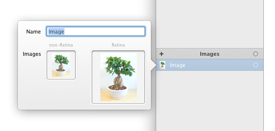
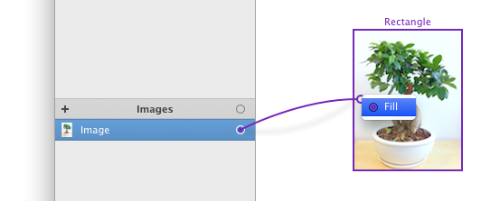
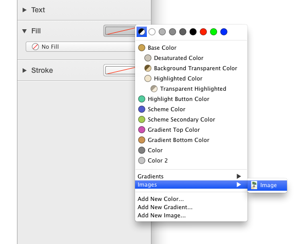
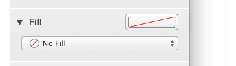
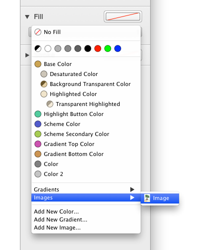
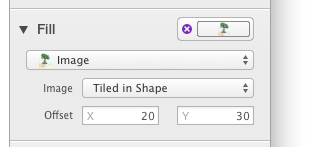

# 图片

总是只能用图片的情况。比如，你可能想要在你的设计中使用真实的照片。我们在 PaintCode 中添加了对图像的支持，让你可以做到这一点:

库中的 `'Images'` 部分可以让你创建和管理图片。你提供图片的 Retina 和 none-Retina 版本。

往你的文件里导入图片最方便的方式从你的 Finder 里拖拽图片到你库里。 PaintCode 会在导入过程中自动配对你的 1倍 和 2倍 图。在你没有给图片添加 @2x 后缀时，PaintCode 甚至会分析图片内容来进行配对。

或者，你可以通过一下的方式来导入图片：

- 使用 `File / Import` 菜单
- 在 图片编辑弹出窗口 中将图片 拖放 到 图片按钮槽 中
- 在 图片编辑弹出窗口 中双击一个 图片按钮槽

## 使用图片

所有的图形都能够用图片田中。一个简单的方法是 点击拖拽图片的链接点到画布的一个图形上。

或者，当检查器里的填充按钮槽是空的时候，你可以点击它来显示所有可用于填充的菜单。

最后，你可以在检查器中使用 填充弹出按钮 来选择合适的填充：

## 图片填充行为

你可以在三种的图片填充行为中选择：

- `'Single'`
- `'Tiled in Shape'`
- `'Tiled in Background'`

另外，你还可以指定图片的 `'X'` 和 `'Y'` 偏移量。

通常，绘图画板中使用的是 none-Retina 版本的图片。不过你可以通过打开 PaintCode 的 Retina 模式来使用 Retina 版本的图片。在这方面 PaintCode 生成的代码是很通用的，并且在 Retina 和 none-Retina 显示器上都可以很好地执行（当然，是你在项目中提供了必要的图片的前提下）。

导入到 PaintCode 的所有图片都存储在 PaintCode 文档中，所以当项其他设计或开发人员发送文件是，你不用担心去路径丢失之类的。通过使用新的导出功能，你可以一次将所有图片导出到电脑里。
