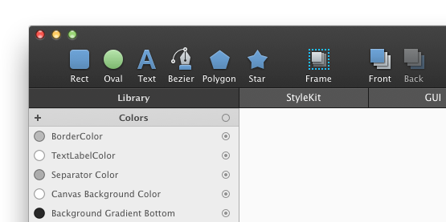
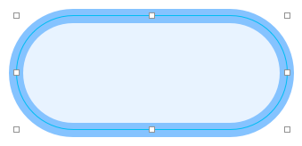
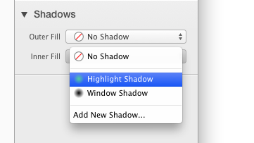
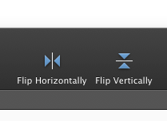
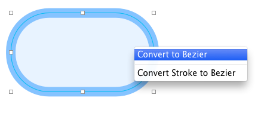

# 形状

## 新增形状

- 首先，在工具栏中选择想要的形状。
- 在画布任意位置按住鼠标。
- 拖动鼠标。
- 当你觉得形状OK时，松开鼠标即可。

你按下鼠标的点和你松开鼠标的点，就是新增形状的对角（贝塞尔形状除外）。

PaintCode 会自动是新增图形吸附其他图形。不过你可以按住 `'Command'` 键来抑制这个行为。

[视频](https://youtu.be/R7toGPNrxUI)

## 创建长宽相等的形状

如果想要创建一个 正圆、正方形、正多边形或正星形，在拖拽的时候按住 `'Shift'` 键。

## 重命名形状

虽然 PaintCode 会帮你生成名字，但是你还是应该改一个更具描述性的名字。这个名字会在生成的代码中用到。

要改变一个形状的名字，只需要选中那个形状，然后在检查器中输入一个新名字。

## 删除形状

要删除一个形状，选中它然后按 `'Delete'` 或 `'Back space'` 键。

## 移动形状

你可以用鼠标拖拽来移动任意形状。形状会自动吸附其他的形状来帮助你对其，不过你可以按住 `'Command'` 键来抑制这个行为。

默认情况下，PaintCode 会试图通过吸附对齐到点网格来保持图形的清晰。当你按下 `'Option'` 键时，形状会吸附到半点网格坐标。此外，你可以按住 `'Command'` 键来抑制这个吸附行为。

## 通过键盘来移动形状

你可以使用方向键来移动选中的恶图形。默认情况下，会在指定方向上移动一个点。

如果想移动半个点，按住 `'Option'` 来移动方向键。

如果想每次移动 10 个点， 按住 `'Shift'` 来移动方向键。

## 调整形状大小

如果想在特定方向上调整一个形状的大小，选中并拖动相应的控制点。 PaintCode 会通过吸附其他形状来帮你。你可以按住 `'Command'` 键来抑制这个行为。

PaintCode 还会试图通过合适地对齐到点网格来保持形状的锐利。按住 `'Option'` 切换到半点网格。如果要完全抑制这个吸附行为，那么按住 `'Control'` 键。

如果想要在拖动一个角上的控制点时保持形状的比例，那么按住 `'Shift'` 。

## 设置填充或描边

有三种给形状设置填充和和描边的方式。需要注意的是，对于填充，你可以用同样的方式来给它设置 渐变 和 图片。

第一种，你可以通过 **拖拽** 链接点到一个画板的图形中，然后选择一个你想要与该颜色链接的属性。链接点的位置是在库中颜色的旁边。如果一个颜色没有实际在文件中使用到，取而代之的是一个空心圆。

另一种使用颜色的方式是使用检查器里的 **Stroke** 或 **Fill** 按钮槽。当按钮槽是空的时候，意味着它的属性（描边或填充）还未被设置。当你点击按钮槽，会出现一个菜单来供你选择你想要使用的颜色。这个菜单里同步了库里边的项，在它的顶部还有系统色可以选择。

顺便一提，当你不想在图形中使用这个颜色的时候，只需要点击 按钮槽 左侧的紫色圆形 `'x'`。

第三种使用颜色的方式是在 颜色弹出按钮菜单 中选择它。

上面的三种设置颜色的方式效果是一样的 —— 你选择你觉得最方便的那个就好。对于填充，你可以用同样的方式来给它设置 渐变 和 图片。

## 设置阴影

在 PaintCode 里，你可以分别给 填充、描边和文字设置阴影。对于填充和文字，你还可以设置内阴影。

这些选项会在你设置好 填充、描边或文字的时候会出现在检查器的阴影选中里。（意思就是，当一个形状没有设置填充的时候识别没法给它设置阴影的，对于描边和文字也是一样的）。

要使用一个阴影，**拖拽** 它的链接点到一个画板的图形中：

或者，你可以从检查器里的 阴影弹出按钮 选择一个阴影。

这个菜单自动同步了 库中的阴影。需要注意的是 `'Fill'` 和 `'Stroke'` 阴影是分开的。填充和文字还支持内阴影。

## 透明和混合模式

透明度和混合模式也可以更改。他们影响的是底层图形绘制形状上方式。有关更多信息，请参阅 [Apple's blend mode documentation](https://developer.apple.com/library/mac/documentation/graphicsimaging/conceptual/drawingwithquartz2d/dq_images/dq_images.html#//apple_ref/doc/uid/TP30001066-CH212-CJBIJEFG)。

## 复制其他形状的样式

创建一个与其他已经绘制好的形状具有相同样式的新形状通常很方便。首先，选择一个你想要拷贝样式的形状。然后，创建新形状。新创建的形状会自动匹配前面选择的形状的样式。

## 翻转形状

要水平和垂直翻转一个形状，在工具栏上单击对应的图标就可以了。

当然，如果你不嫌麻烦你也可以在程序菜单里找到选项： `'Selection / Flip Horizontally'` 和 `'Selection / Flip Veritcally'`。

## 收缩和扩展 形状

当你收缩一个形状时，它的变会向里推。扩展形状则相反。要收缩和扩展形状，在工具栏中单击相应的图标。或者，在程序菜单里找到选项： `'Selection / Contract'` 和 `'Selection / Expand'`。

## 将一个形状转换为贝塞尔形状

你可以将任何的形状转换成贝塞尔形状。有时候贝塞尔形状会更加有用，因为你可以编辑和旋转它们。

要转换一个形状成为贝塞尔，选择一个形状然后 在应用程序菜单里找到 `'Selection / Convert to Bezier'`。你也可以在画板中右键调出菜单来转换。

## 编辑形状

一些形状是可以编辑的（比如文字、贝塞尔和组）。你可以通过双击或按键盘上 `'Return'` 来编辑形状。
