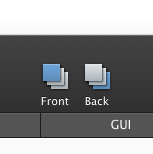

# [选择](_cover.md)

## 选择单个形状

要选择单个形状，只需直接在画板中单击它。或者，你可以在 形状和组浏览器 中点击它的名字来选择它。

## 选择当前选择项背后的形状

要选择一个当前选择项背后的形状，你需要按住 `'Command'` 键再进行选择。

## 选择多个形状

你可以通过以下几种方式来选择多个形状

- 拖选 —— 在画板的空白区域按下鼠标，然后拖向你想要选择的形状
- 按住 `'Shift'` 键然后选择一个单独的形状，一个个添加
- 在 形状和组浏览器 里选择多个行

## 修改选择项

可以通过按住 `'Shift'` 键来修改当前的选择项：

- 单击一个未被选中的形状将它添加到选择项
- 单击一个已被选择的形状来从选择项中移除它
- 使用拖选来一次性添加或移除当前选择项中的多个形状

## 删除选择项

要删除选择项，然后按 `'Delete'` 或 `'Back Space'` 键。

## 重新排列形状

你可以直接使用工具栏将选择项移动到画布最前面或者最后面。

或者你也可以使用应用程序菜单来对形状顺序进行更详细的控制：

- `Option` + `Command` + `上箭头` 将选择项向前移动。
- `Option` + `Command` + `下箭头` 将选择项向后移动。

## 只获取选择项的代码

PaintCode 会显示画板中所有形状的生成代码。不过，你也可以只获得当前选择形状的代码。只需要选择画板中你想要的形状，然后把他们复制到剪贴板中（ `Command` + `C` ）.当你粘贴这些形状到代码编辑器中时，粘贴的就是绘图代码。
