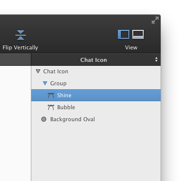
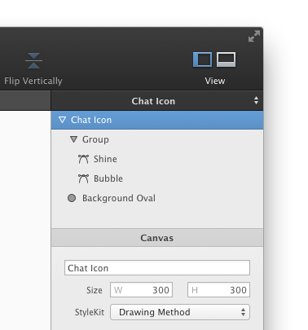
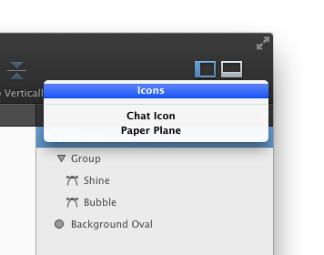

# [形状和组浏览器](_cover.md)

形状和组浏览器显示了你文件里所有的形状和组的层级树。形状和组浏览器里所列的就是它们在画布里的绘图顺序。你可以通过名字旁边的小图标来分辨一个形状是否含有填充。

另外，这个浏览器里的选择和画布里的选择是同步的。要选中一个画布里的形状，你可以在浏览器里点击它的名字。你还可以一次性选中多个形状。你可以在浏览器里上级一个 Bezier 来编辑它。

当你双击一个组，这个组将被激活，你就可以在画布中选择和编辑它的内容了。或者，当你选择属于浏览器中的某个组的形状时，收起的组也会自动激活。被激活的组的下三角会变为蓝色。

要删除一个形状或组，选中它然后按 `'Delete'` 或 `'Back Space'` 键。要上下导航，按 `'Command'` + `'上方向键'` 或 `'Command'` + `'下方向键'`。

你可以通过在浏览器中拖动行，来重新排列它们的顺序。这就相当于使用 `'Bring to front'` 和 `'Send to back'` 命令。你还可以拖动形状来把它移到一个组里（或移出）。

## 画布设置

形状和组浏览器最顶部的那一行实际上就是你当前选中的画布。如果你在浏览器中选择它，那么与它相关的设置就会出现在下方的检查器里。

## 选择不同的画布

你的标签里可能包含里很多的画布。形状和组浏览器里只显示出当前被激活标签的内容。你可以选中它的标题，然后在弹出的菜单里选择其它画布。

