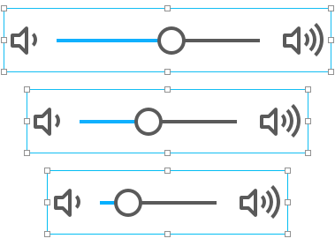

# 组

当你组合了几个形状，那么得到的组的就变得跟一个形状一样可以调整大小和在画布里移动。这个功能在复杂的文件里就很有用，因为它提供了一种可以隐藏复杂性的方法，是文档在设计过程中变得更加易于管理。你还可以：

- 创建一个智能组，使得其内容可以自定义大小
- 给组内容添加一个外阴影
- 调整组内容的透明度
- 通过非标准混合模式来达到有趣的视觉效果
- 使用特定的形状来裁剪组

## 创建和取消形状分组

要创建一个组，在画布中选择一个或多个图层，然后选择工具栏上的 `'Group'` 图标。要进行相反的操作，则选择你要取消的组，然后选择工具栏上的饿 `'Ungroup'` 图标。

组可以嵌套，意思就是可以可以有组里的组。

## 编辑组

要编辑组，只需要双击它（直接在画布里或者形状和组浏览器里）。或者，你可以在形状和组浏览器里选择一些组的子形状。这样就会激活收起的组。

当一个组被编辑（或激活），那么它里边的内容就可以被自由地修改和移动。被激活的组的在形状和组浏览器里的三角会变为蓝色。

要结束编辑组，按 `'Esc'` 键或在画布外的空白区域。

## 阴影和不透明度

通过在检查器里设置，你可以给整个组设置阴影。整个组就会生成一个跟单独的形状一样的阴影。给组里单独的形状设置阴影（左边）和给整个组设置阴影（右边）之间还是有区别的。

同样的，组的透明度也可以被设置。就跟阴影一样，给整个组设置不透明度和给单独的形状设置阴影的方法是一样的。给重叠图形设置50%不透明颜色（左）和给一个组设置50%不透明度（右），看起来是不一样的。

## 混合模式

混合模式影响的是组的内容在底层图形上的绘制方式。有关更多信息，请参阅 [Apple's blend mode documentation](https://developer.apple.com/library/mac/documentation/graphicsimaging/conceptual/drawingwithquartz2d/dq_images/dq_images.html#//apple_ref/doc/uid/TP30001066-CH212-CJBIJEFG)。

## 裁剪

在组的检查器里，你可以选择一个裁剪形状（可选的）。组的绘制会限制在内部的裁剪形状里。裁剪形状在绘图画布中看起来是黑白色的虚线。

## 智能组

使用智能组，你可以定义组的内容 当给组调整大小和在画板中移动组时候的行为。举个例子，你可以用这个来创建一个可以调整大小的 UI 空间，然后在画板中方便地多次复用它。每个控件都可以用一个单独的智能组表示，并且很容易操作：

创建一个智能组真的很容易。首先使用 `'Frame'` 创建一个动态绘图。然后选择整个绘图（包括 `'Frame'` ）来创建组。得到的组就是智能组 —— 当你调整它的大小时，它里边的内容会根据你设置内容和 `'Frame'` 的关系时指定的缩放约束条件来调整。

如果你已经有创建好组了，那么你只需要在里边添加 `'Frame'` 就可以把它转换成智能组了。

实际上，普通组和智能组间唯一的区别就是智能组里有 `'Frame'`。如果你在一个组里放一个 `'Frame'`，那么这个 `'Frame'` 影响的只有这个组内的形状。

在上图中你可以看到滑块控件智能组的结构。通过 `'Frane'` 给它设置合适的缩放约束，我们就创建了一个可以轻松调整大小和可复用的组。
