# 变换

你可以 通过旋转、缩放和偏移 来变换你的形状和组。和位图绘图应用不同的是，PaintCode 可以在不损失绘图质量的情况下对它进行变换。

你在形状中应用的变换在生成的代码中被转换为仿射变换。需要注意的是，你可以链接变量来改变形状的属性。这对于设计 参数化绘图 很有用，例如，你可以利用旋转来设计一个环形进度指示器。

所有重要变换属性都在检查器中的 `'Transform'` 框中找到。默认情况下，这个框是收起的。

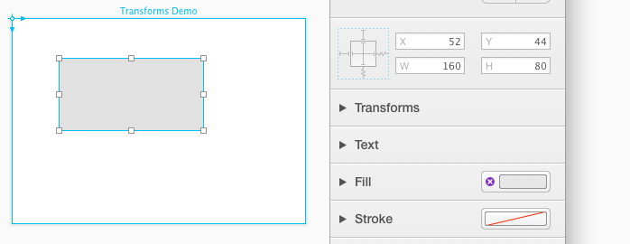

要找到各种变换属性，需要单击检查器中 `'Transform'` 的标题来展开它。点击之后，你就可以在这里找到指定形状的旋转、X偏移、Y偏移、X缩放和Y缩放的文字输入框。

也许更重要的是，一个新的符号会出现在你画板中形状的旁边。

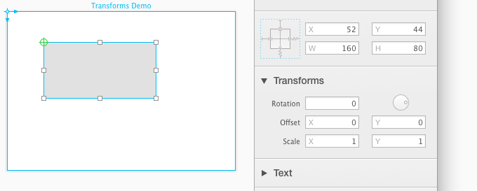

## 变换原点

这个绿色的符号被称为“转换原点”，它非常重要。这是形状所有变换的原点。这意味着当你旋转形状是，它将会围绕着这个点旋转。缩放和偏移也是一样的道理。只有在检查器中展开 `'Transform'` 框是，原点符号才可见。

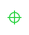

## 旋转变换

当你将鼠标放在原点上时它会出现一个圆形边框。拖动这个圆形边框就可以旋转形状。（或者，你也可以通过按住 `'Command'` 键并拖动画板中形状的一个控制点来旋转它，即使当检查器里的 `'Transform'` 框关闭，看不到原点时。在这种情况下，形状的原点会自动移动到旋转图形的中心）。

默认情况下，原点形状的一个角上。在 iOS 上，默认是在左上角。在 macOS 上，它通常在左下角，但如果你使用翻转的画布，这种情况就会改变。

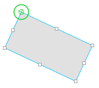

不过你可以原点移动到任何你想要的位置上，你只需要拖动原点的中心。

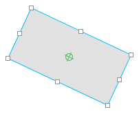

当你拖动原点时，你会发现他会吸附到形状的角、中心以及其他形状的原点上。要想禁止这个行为，在拖动时按住 `'Command'` 键。默认情况下，原点不会与点网格对齐。不过你可以通过按住 `'Control'` 键强制它与点网格对齐。

## 偏移变换

偏移变换可以让你讲一个形状偏移它的变换原点。这里需要理解的重要事情是，你经常在检查器里使用的 X 和 Y 位置属性并不是你形状的角的坐标。事实上，这些你形状的变换原点的坐标 —— 下图中的红色箭头说明了这一点：

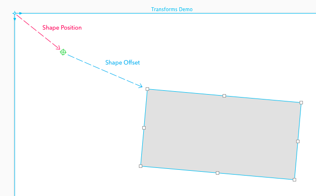

通常来说，形状的偏移变换（蓝色箭头）为 0，所以形状的角的坐标和它的变换原点的坐标是同一个而且相同。如果你使用了非 0 的偏移变换，那么这种情况就会改变。

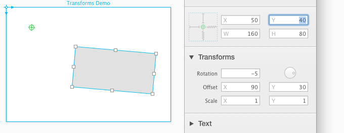

## 缩放变换

缩放变换使你的形状沿着它的 X 和 Y 轴伸缩。在下方的例子中，蓝色的矩形和灰色的矩形有着相同的宽高，但是缩放变换让他们的大小在画板中看起来不一样了。

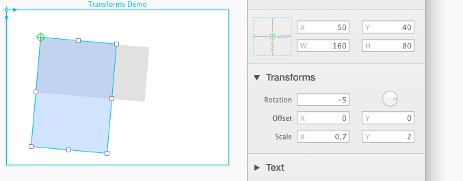

## 变换顺序

变换的是通过以下顺序应用的：

- 偏移量
- 旋转
- 缩放

## 形状的 X 和 Y 位置究竟是什么？

在 “偏移变换” 部分，我们已经解释了你最经常使用的检查器里形状在画布里的 X 和 Y 的位置坐标实际上是绿色的原点的坐标。

然而，这并不是全部的真相 —— 问题依然存在，这些位置坐标和什么相关？当你在画布里画一个形状，然后将它放在坐标上（X=200，Y=100），这些数字实际上意味着什么？很明显，它意味着这个形状应该被放在点（200，100）上 —— 但是从哪里开始算起？0点在哪里？

幸运的是，在大多数情况里情况都非常简单 —— X 和 Y 的坐标就和整个画布的绘图原点相关。在 iOS 里，就在 画布 的左上角，但是如果你想的话你可以移动它。

但是如果你开始使用变换的组的时候情况就变得复杂起来了。在下面的例子中，我们在一个组里放了3个矩形。然后我们使用旋转变换旋转这个组。

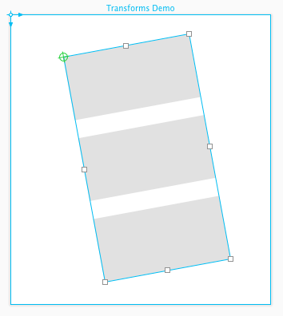

下面是它在 形状和组 浏览器里的效果：

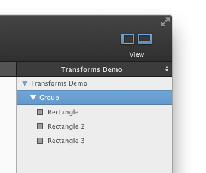

当你在变换的组里选择一个形状，你会发现他的 X 和 Y 位置坐标分别是 0 和 103。

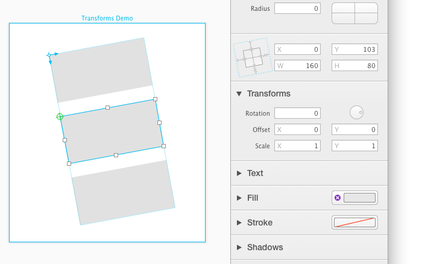

这是因为旋转的组的原点已经变为了整个内容的坐标系原点。所有变换的组都是这样的。

如果满足以下任何一个条件，一个组都会被认为已经变换了：

- 旋转角度 非0
- 偏移 非0
- X 和 Y 的缩放不等于1
- 变量附加到组的 `'rotation'`、`'scale'` 或 `'offset'`

在上图中，你可以看到由两个正交的蓝色箭头表示的当前坐标系的原点。这些代表了坐标系的 X 和 Y 轴。

简而言之，形状的 X 和 Y 位置是由它所在的坐标系的位置决定的。这个坐标系的原点由它的上层被变换的组中继承定义，如果它的上层中没有被变换的组，那么则使用画布的原点。
