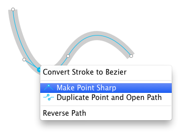
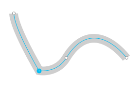

# Beziers 
> Tovi注： Bezier，贝塞尔形状、图形，PaintCode 文档里这个词会频繁出现，后面还是不翻译了，而且 PaintCode 工具蓝里，菜单里都是以 Bezier 出现。

## 绘制直线

- 从工具栏中选择 `'Bezier'` 工具
- 单击要开始一条新直线的点
- 在移动指针前，松开鼠标按钮
- 点击别的地方
- 在移动指针前，松开鼠标按钮
- 你可以选择继续重复前面的两个步骤来绘制折线
- 你也可以选择通过单击第一个控制点，来绘制一个多边形

注意：在松开鼠标前移动指针会使线条弯曲，这样就画不直了。

## 绘制曲线

- 从工具栏中选择 `'Bezier'` 工具
- 单击要开始一条新曲线的点
- 按下鼠标后不要松开，将指针移动到想要的第一个曲线手柄的位置
- 松开鼠标按钮
- 单击要结束曲线的点
- 按住鼠标按钮，将指针移动到新的位置后松开鼠标
- 可以选择继续重复前面的两个步骤来绘制更复杂的曲线
- 也可以通过单击第一控制点来封闭由曲线包围的区域

你可以随时通过释放鼠标按钮而不移动指针来绘制一个直线线段（或者只有一个曲线手柄的曲线段）

## 编辑 Bezier

有三种编辑 `'Bezier'` 的方式：

- 双击一个 `'Bezier'` 形状、
- 选择一个形状然后按 `'Command'` + `'E'`
- 选择一个形状然后按 `'Return'`

## 拓展 Bezier

没有封闭的 `'Bezier'` 可以从两端继续拓展：

- 选择要编辑的 `'Bezier'`
- 激活编辑模式（双击它）
- 单击其中给一个端点
- 按 `'Option'`、`'Command'`、`'Shift'` 或者 `'Control'` 来激活拓展
- 现在，当你移动鼠标你应该就能看到可能的 Bezier 的拓展的黄色提示
- 将指针移动到想要的位置然后单击，根据你什么时候松开鼠标，你可以绘制出直线或者曲线。
- 或者，你也可以点击 Bezier 的另一段来封闭它

## 在 Bezier 的中间添加新的控制点

要在 Bezier 的中间添加新的控制点，只需要在你想要添加的地方单击一下。这将在那个点上将曲线分成两条曲线，保持原来的曲率。

## 在添加新控制点时控制吸附行为

默认下，当你添加控制点时它们会吸附到（水平和垂直的） Bezier 的其它控制点上。要抑制这个吸附，按住 `'Command'`。

PaintCode 会试图将控制点吸附到那些可以保持形状锐利的坐标上，恰当地将点对齐到点网格。如果你不想要这个行为，那么在放置控制点的时候按住 `'Control'`。在两种行为之间的是 `'Option'` 键 —— 它将会强制控制点的坐标是整数点或者0.5点。

通常需要画一条水平线、垂直线或对角线。要限制新控制点的位置来画这种类型的线，按住 `'Shift'`。

## 调整控制点位置

你可以通过拖拽来调整单个控制点的位置。PaintCode 会将控制点对齐到一定的位置上来帮你绘制锐利的图形。这种行为取决于描边和描边宽度设置，因此最好在移动控制点之前将它们设为 最终值。

不过不用太担心，即使你忘了这么做，你也可以在之后进行调整。但是如果，举个例子，如果你画了一个描边为 1 的 Bezier，然后再将它改为 2，你的绘图看起来可能就没那么好了。要解决这个问题，你必须重新手动调整控制点，PaintCode 不会在你改变描边设置时重新排列这些点。

没有按任何修饰键的时候来移动控制点的时候是很生硬的（因为他会进行吸附）

当按下 `'Option'` 键，被拖动的控制点在释放时会位于半点网格中。

当按下 `'Control'` 键，移动控制点的吸附行为就会消失 —— 你可以在任意位置释放控制点。

PaintCode 为了协助你画图，当你移动控制点的时候，它还会自动对齐其它的控制点。但是你也可以通过按下 `'Command'` 来关闭这个行为。

## 用键盘来调整控制点的位置

你还可以用键盘来调整控制点的位置。先单击选中一个控制点，然后用方向键来移动它。默认每次移动一个点。

如果想快速移动它，按住 `'Shift'` 同时移动方向键，就可以每次移动 10 的倍数。你还可以每次移动半个点 —— 只需要在移动方向键的时候按住 `'Option'`。

通过按住 `'Command'` + 左方向键或右方向键，你可以将当前控制点的选取移动到相邻控制点。

## 调整曲线手柄

可以通过移动曲线手柄来调整它们。 如果控制点和它的两个手柄是对齐的，那么当当你移动其中一个手柄的时候另一个也会一起移动来保持对齐。如果要抑制这个行为，那么在调整时按住 `'Option'`。

另一方面，如果控制点和它的两个手柄不是对齐的，那么两个手柄则会独立移动。这种情况下，你可以按住 `'Option'` 来强制它们对齐。

如果想要将曲线手柄水平、垂直和对角线对齐，那么拖动的时候按住 `'Shift'`。

## 控制曲率

控制点并不总是同时具有两个曲线手柄。 例如，对于直线或折线，控制点没有任何曲线句柄。 您可以在任何时候添加和删除曲线手柄。

要移除曲线手柄，选择然后按 `'Delete'` 或 `'Back Space'` 删除它。

要给一个控制点添加曲线手柄，从控制手柄菜单里面选择 `'Make Point Round'`。要移除曲线手柄，那么就选 `'Make Point Sharp'` 选项。

## 封闭 Bezier

- 选择一个端点控制点
- 按 `'Option'`、`'Command'`、`'Shift'` 或者 `'Control'` 来激活拓展
- 选择另一个端点。当你将指针悬停上去的时候你会看到一个封闭 Bezier 的预览

## 控制点菜单

控制点除了可以控制曲率之外，它的菜单提供了更多好用的功能来 移除控制点、打开路径、复制路径，甚至扭转轮廓的方向，这些对于你用 PaintCode 生成 Bezier 动画曲线是很有帮助的。

## 线段的菜单

Bezier 的线段也有一个属于它的菜单。你可以通过它来删除一个线段或者在线段的任意点上将其拆分。

## 布尔预算

PaintCode 支持3 种布尔运算：`'Union'`、`'Intersection'` 和 `'Difference'`（分别是联合、相交和相减）。要使用他们很简单。首先在画板中选中两个或两个以上的形状。然后在工具栏中选择相应的操作图标，或者也可以在应用程序菜单里选择 `'Selection / Union'`、`'Selection / Intersection'` 和 `'Selection / Difference'` 中的一个选项。

PaintCode 会直接生成目标形状。这个形状会继承它们最底部的那个形状的的外观设置（比如描边和填充）所有的原始图形会保持不变。

给 Bezier 使用变换

就想其它所有的形状和组一样，Bezier 也可以应用 Rotaion、Scale 和 Offset 这些变换。对于 Bezier， 甚至还可以给控制点应用变换。这将重新计算所有控制点的位置，并从 Bezier 中移除变换。

应用了变换的 Bezier：

