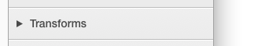
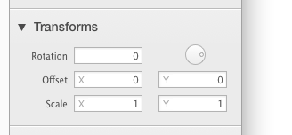

# 检查器

检查器是你可以用来调整对象属性的地方，通常是指选中的形状。检查器支持多选，所以你可以可以同时编辑多个形状。

当你选中的是画布本身，那么检查器里就会出现关于画布的设置。

## 重命名形状

检查器里的一些框是可以关闭和打开的。你可以关闭一些框，来更好地聚焦到对你更重要的检查情属性上。

点击框的标题就可以打开关闭它们。

注意，你的 绘图画布的 UI 会随着你某个检查器的打开而改变。举个例子，当变换框打开的时候，变换（旋转缩放）原点才可见。同样的，只有当 填充框 打开时，调整 `'two-point'` 和 `'circular'` 渐变的控件才会可见。
