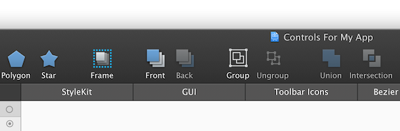
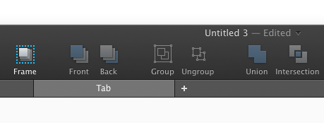

# 使用标签页

你可以使用标签页来管理 PaintCode 文件的绘图。每个标签页都可以包含多个绘图画布。

第一个标签页叫 `StyleKit`，它比较特殊，你可以在这里找到你的 Stylekit 分类 —— 一个绘图、颜色、渐变和其他设计资源的集合，你可以直接把它导出成一个单独的 Objective-C、 Swift 或 C# 类。Stylekit 让你轻松地将生成的代码集成到你的项目中去。

## 管理标签页

要添加一个新的标签页，只需要点击最后一个标签页后的 `'+'` 号。

而要删除一个标签页，将鼠标移动到它的上面就会出现一个 `'X'` 号，点击它即可删除。

你可以通过拖动他们来重新排列标签。

需要注意的是，`'StyleKit'` 标签页永远会在第一个，而且不能删除和重新排列。当你文档中包含了太多的标签页，导致标签栏都放不下时，多出的标签页可以通过点击 `'...'` 按钮展开，会出现一个溢出标签的列表。

## 重命名标签页

你可以通过双击标签页来给它命名。或者你可以取消选择工作区里的所有画布 —— 这样你就可以在右边的检查器中看到一个显示着当前标签页的名字输入框。