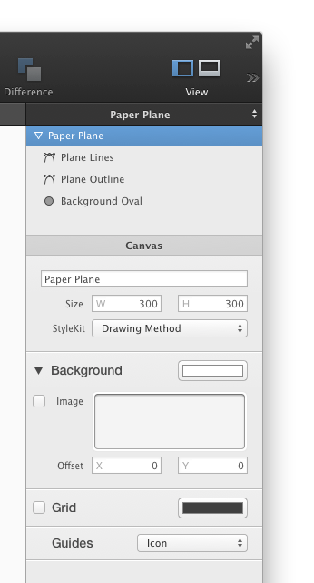
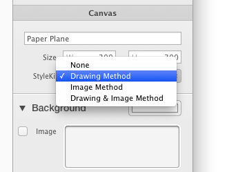
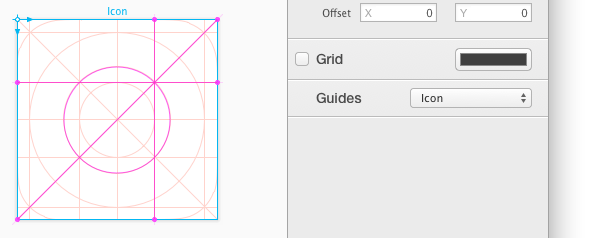

# [画布设置](_cover.md)

## 画布设置

要打开画布设置，在工作区里点击画布的标题。或者你也可以在形状和组浏览器里点击它。

然后画布的相关设置就会出现在检查器里了：

## 给画布取名字

在检查器最顶部的文字输入框里，你可以修改画布的名字。这个名字会被生成的绘方法使用。或者将画布导出为图片的时候也会使用到。

## 修改画布大小

要改变画布的大小，只需要在文字输入框里输入相应的大小。或者，你也可以在工作区里通过拖动画布的边缘来修改画布的大小。注意，这个只有当你没有选择到画布里的形状时才会起作用。

## 修改 StyleKit 设置

通过 StyleKit 按钮，你可以修改一个画布的代码生成设置。最重要的是，你可以选择画布要生成哪些：

- 不生成方法
- 只生成（空的）绘方法（`'Drawing Method'`）
- 实时生成图片的方法（`'UIImage'` 或 `'NSImage'`）
- 生成以上两种

当你选择了画布要返回图片的方法（`Image Method`）时，而且目标代码是 iOS 时，会出现更多的设置。这些设置比如，如果你想要的话你可以设置生成图片的 `Cap Insets`，还有就是选择图片的渲染模式。

你还可以设置应该对添加到这个`Image Method`生成的 `'IBOutletColection'` 中的对象，调用哪一个 `'Selector'`。

![画布 StyleKit 设置]](./images/canvas_stylekit_settings.png)

PaintCode 还生成[缩放的绘图方法](Part.5.stylekits&code_generation.C.resizing_drawing_methods.md)，这将允许你在保持长宽比例同时将画布绘制成不同目标矩形大小。

## 修改画布的背景色

要修改画布的底色，只需要在检查器里点击颜色按钮槽。注意，这个底色对于生成的代码没有任何影响。

还要注意，当你导出有背景色的 TIFF、PDF 或者 PNG 时，这个颜色会被导出。如果要导出透明背景的图，那么将底色设置为黑色或者白色，或者在导出绘图的时候关闭 `'Export Background'` 复选框。

## 修改画布的背景图片

首先要确保图片槽旁边的复选框已经被钩上。然后，拖放一个你想要图片到图片槽中。你还可以使用下方的控件偏移背景。

## 显示/隐藏网格，和更改它的颜色

要显示/隐藏画布的网格，勾选画布设置里的 `'Grid'` 设置，快捷键是 `'Option'` + `'G'`。

PaintCode 会根据画布的底色自适应网格的颜色。不过你也可以设置你自己的网格颜色。只需要在颜色槽中选择。

## 画布网格

画布的最后一个设置是内置的绘图网格：

- iOS 图标网格布局指南
- Apple Watch 图标布局指南
- 纵栏布局指南
- 横栏布局指南
- 纵横布局指南

图标网格对于绘制外观和谐的 iOS 应用图标是非常有帮助的。

纵横栏布局指南则可以栏和间隔的大小，对于画一些更复杂的网格布局的绘图的时候是非常方便的。比如，这个网站就是在 Paintode 中使用网格布局设计的。
