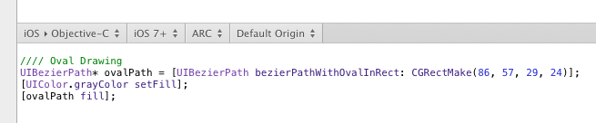

# [代码导出](_cover.md)

PaintCode 会随着你绘制的时候即时生成代码。有几个影响代码导出的设置，你可以在 生成的代码上面的中部工具栏里边方便地找到这些所有的设置。注意，你可以上下拖动中部工具栏，来调整**代码视图**的大小。

## 目标代码

首先你要先挑选一个目标代码：

- macOS ▸ Objective-C
- iOS ▸ Objective-C
- macOS ▸ Swift
- iOS ▸ Swift
- iOS ▸ C# Xamarin
- Android ▸ Java
- Web ▸ SVG
- Web ▸ JavaScript Canvas
- Web ▸ HTML + CSS

你可以在中部工具栏里边使用目标代码按钮对它们进行详细的设置。

这些设置只会影响到生成的代码，你的绘图并不会改变。

## 最低支持版本

你可以在第二个选项里设置最低支持版本。比如，你选择了 iOS 5+，意味着生成的代码只会调用支持 iOS 6 的 API。通常，你应该选择你计划在你的应用中选择支持的最低版本。

## 内存管理

对于 **Objective-C** 代码，还有个内存管理设置可以选择。你可以 **ARC** 和 **Retain/Release** 这两种内存管理模式中进行选择。

## 绘图原点

最后，你还可以设置绘图原点。这是一个 per-canvas 设置。(0,0)的位置会根据你有没有移动绘图原点而不同。例如，在 macOS 中默认的绘图原点在左下角，而 iOS 默认在左上角。

注意：实际上你可以在画板中通过移动原点图标来移动绘图原点。
