# StyleKits

`'StyleKits'` 是更好的将生成的代码集成到你的 `'Xcode'` 项目中的方式。

[视频](https://youtu.be/QLoJrgVg8Ok)

`Stylekits`:

- 在将生成的代码放入 Xcode 项目之前，不需要手动调整它
- 允许您调整 PaintCode 文档，然后在几秒钟内将更改重新集成到 Xcode 项目中
- 允许真正快速的设计原型

## 什么是 StyleKit？

StyleKit 是包含你所有的绘图、颜色、渐变、阴影和其他设计素材的，特殊的 Objective-C、Swift、C#、Java 或 JavaScript 类。所有这些东西可以通过 StyleKit 类中的方法获得，随时调用。

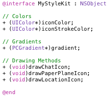

在 PaintCode 中，在单个文件中你可以有多个绘图画布，每个画布都生成相应带 StyleKit 类的绘方法。当你在你的代码中调用这些方法时，它画布中的内容就会被绘出来。

通过将你所有的 PaintCode 绘图放在一个单独的 StyleKit 方法里（然后通过类的公共接口在代码中使用该类），我们是代码集成的过程变得非常顺滑。无论什么时候你想要修改你 PaintCode 中的绘图，你只需要将 StyleKit类（两个文件）重新导出到 Xcode 项目中。无需手动修改生成的代码 —— 你甚至连瞅一眼它们都不用！！！

## StyleKit 目录

要创建 StyleKit， 单击第一个 `'StyleKit'` 标签页 —— 在左边，工具栏的下方。

这就是 StyleKit 目录。这是一个你想将所有的东西放入生成的 StyleKit 类的目录。当你滚动到目录的最后，你会看到绘图画布。每一个被放入 StyleKit 目录的画布都会生成一个特殊的带 StyleKit 类的绘方法。

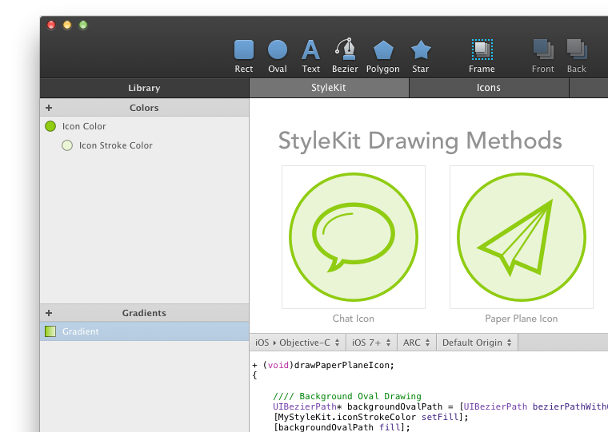

StyleKit 目录还包括了颜色、渐变、阴影和图片。

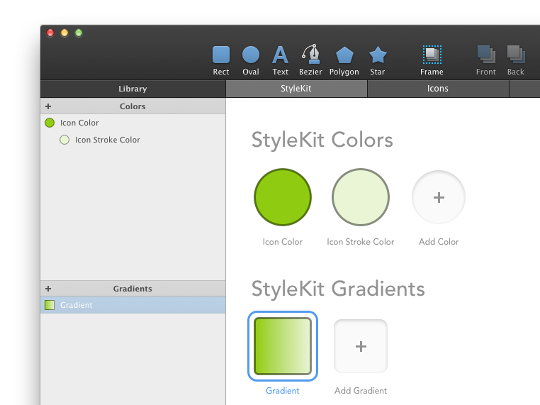

## 在 StyleKit 里添加 颜色 和其他库项

要在 StyleKit 目录中添加一个库项（比如颜色），只需要将其从 库 中拖放到 目录中。

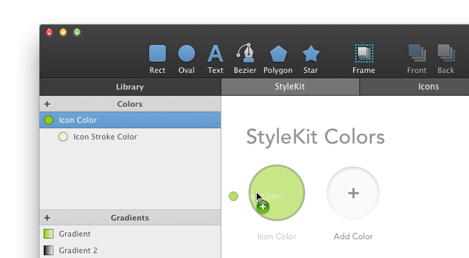

或者你也可以通过点击 `'Add Color'` 占位图，然后从弹出的菜单里选择一个颜色。渐变、阴影和图片也可以用类似的方式来添加。

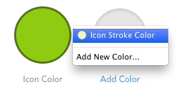

当你在 StyleKit 目录里添加里一个库项后，一个有着相同名字的类方法就被添加到生成代码中了。通过在你的代码中调用这个 StyleKit 方法，你可以轻松地访问库项。

## 从 StyleKit 里移除颜色和其他库项

要从 StyleKit 里移除颜色和其他库项，只需要在目录中选中它们，然后按 `'Delete'` 或 `'Backspace'`

或者，你也可以将它们拖放到目录的外面。

重要事项：将一个库项从 StyleKit 目录中移除并不会将他们从库里移出来。当你从目录里移除里一个库项，只意味着在生成的 StyleKit 代码里，你就没有可以访问到类型的生成的公共类方法了。

## 在 StyleKit 里添加画布

在 StyleKit 里添加画布的方式和添加库项的方式稍微有点不同。默认情况下，所有新建的画布都会被添加到 StyleKit 目录里。

不过，你也可以随意移除或添加它们，甚至可以更改 StyleKit 类里，为每个画布生成的内容。

要添加一个画布到 StyleKit 目录里，你需要去画布设置里。画布设置可以通过在工作区里选中画布的名字，来在检查器里打开。或者你也可以选择 形状和组浏览器里的画布 —— 它总是在最最上面的列表。要注意，你需要离开 StyleKit 标签页，然后激活画布所在的标签页。

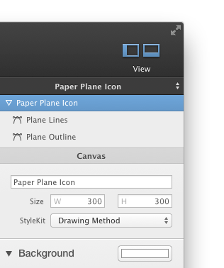

检查器中的 `'StyleKit'` 按钮用来设置选中的画布应该生中什么代码。

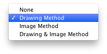

默认情况下生成的是 `'Drawing Method'` 绘方法。不过你也可以选择 `'Image Method'`，他将生成一个返回一个含有你选择画布的内容的 `‘UIImage’` 的方法。

当这个方法被调用时，这个 UIImage 就会被代码绘制。对于简单、没有参数的画布（不带任何变量的画布），产生的 UIImage 由 StyleKit 类自动缓存。这意味着，在调用返回 UIImage 的方法时，不必担心性能问题——该方法的第一个调用实际上是绘制和缓存图像，但后续调用只返回缓存的图像，这是非常快的。

当使用 UIImage 生成方法时，您通常会得到两者的最佳结果 —— 你的绘图是独立于分辨率的，您不必使用位图，但性能与使用 PNG 资源时相同。 此外，您仍然可以轻松地使用许多 UIImages 的 AppKit API。

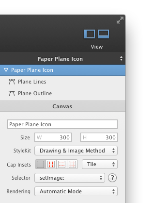

在上图中，我们选了 `'Drawing & Image Method'`。UIImage生成方法和空返回 绘方法都可以作为 StyleKit 类中的公共类方法使用。

## 从 PaintCode 中导出 StyleKit 类

要从 PaintCode 中导出 StyleKit 类，选择 StyleKit 标签页然后点击检查器里的大蓝色导出按钮。

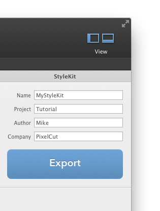

然后会出现一个导出弹窗。快捷键是 `'Command'` + `'E'`。在弹窗里，你要确保选中的是第一个选项卡（StyleKit），然后点击`'Export'` 按钮。然后选择你想要导出 Stylekit 类的文件夹。通常会导出两个文件 —— `'implementation'` 文件和 `'header'` 文件。如果你在 PaintCode 里使用了一些位图，你也可以选择导出它们。

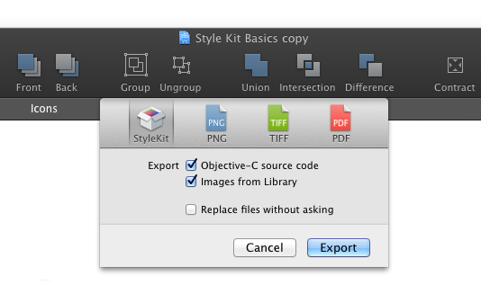

首次导出里 StyleKit 之后，第二次导出就很容易了，你可以使用相同的方式。

> Tovi注：以下内容涉及到 iOS 开发知识，我并不会，如果翻译有误，请大佬们指出。

## 在 Xcode 里使用 StyleKit 类

我们以 Objective-C 作为示例语言，不过 Swift 也几乎是一样的。

在 Xcode 里使用 StyleKit 非常简单。首先，在你的 Xcode 项目中添加导出好的 StyleKit 类（`'.m'` 和 `'.h'` 文件）。然后，在你的源代码中使用 `'import'` 命令将 StyleKit 类导入。

``` Objective-c
#import "YourStyleKitName.h"
```

或者你可以将 `'import'` 命令放到你预编译的头部（`'.pch'` 文件）。使用这种方式，你可以在你所有的源文件中使用 StyleKit，而不用给每个文件添加 `'import'` 命令。

最后，通过简单调用其中的类方法，来实际使用它的 StyleKit 类，就像这样：

``` Objective-c
[YourStyleKitName drawYourCanvas];
```

通常，您可以在一些 UIView 的 overriden draiRect 方法中执行此操作。有关更多信息，参阅以下 StyleKit 基础教程。要获取 StyleKit color，你可以这样做：

``` Objective-c
UIColor* color = YourStyleKitName.yourColor;
```

其他库项，例如渐变和阴影，也是用类似的方式。

注意，当以编程方式使用 StyleKit 时，你永远不需要实例化 StyleKit 类 —— 所有获得你的绘图和库项的方法都是类方法，这意味着你可以在类上调用这些方法，而不是在类的实例上。

还要注意，如果你的画布使用了 `'Frames'` 或 `'Variables'`，那么它生成的类方法会携带参数，从而使你可以轻松地绘制参数化绘图。

## 生成 UIImage 的画布

对于生成 UIImage 的画布，在画布设置中可以使用更多的选项。例如，你可以指定可伸缩 `UIImage` 所必须的 `Cap Insets`。

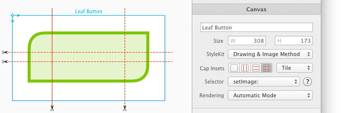

你还可以指定 UIImage 的缩放行为（具体地说，由 Cap Insets 定义的中心区域是应该平铺还是拉伸）。

还可以设置 UIImage 的渲染模式。一些 iOS 的系统控件如 UITabBarItem 使用 UIImage 来绘制图标，但是只使用这些 UIImage 作为模板，在这些模板上使用系统范围内生效的效果。 这种行为通常可以通过切换到 `'Origin'` 渲染模式来防止。

下面是只有一个被设置为生成 绘方法和图片方法 画布的 StyleKit 的样子：

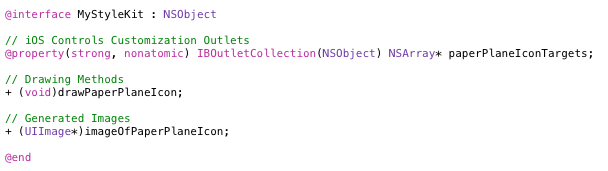

## 在 XIB 和 故事板中使用生成 UIImage 的画布

在上面的代码中，你可以看到被设置为生成 UIImage 方法的画板，同时也会生成一个特殊的 IBOutletCollection。

如果你在 XIB 和 Storyboard 中创建 StyleKit 类的实例对象，你就可以将画布生成的 IBOutletCollection 链接到其他对象。

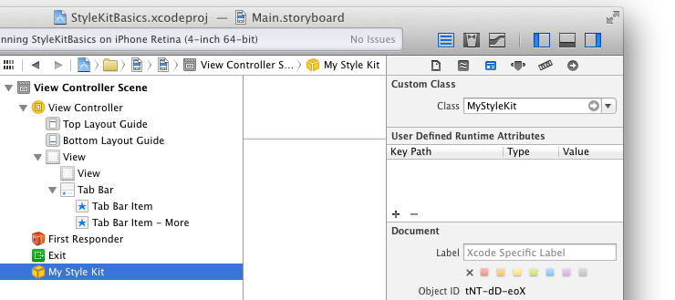

在 XIB 和 Storyboard 中添加了实例对象之后，不要忘记将它们的类改为 StyleKit 的类。

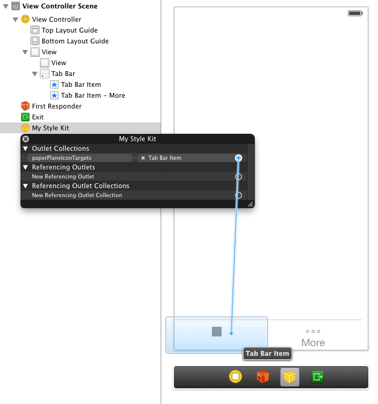

StyleKit 会使用画布生成的 UIImage 作为参数，在你添加到 IBOutletCollection 的对象上 自动调用 `'setImage:‘`方法。

你还可以通过 `'setImage:‘` 方法将在 PaintCode 中绘制的图像可视化地分别给借口中的对象来使用它。在画布设置中，你还可以指定应该使用 `'setSelectedImage:'` 方法。

当您希望可视化地自定义接口对象(如 UITabBarItem)时，这些 IBOutletCollections 非常有用了。

下面是在模拟器中将画布的 IBOutletCollection 连接到 UITabBarItem 的结果：

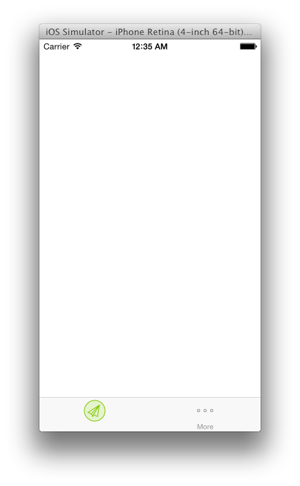

注意：要使用 UITabBarItem，你还必须将其标识符设置为 Xcode Interface Builder 中的 Custom。
重要：所有公共 StyleKit 方法都是类方法。这意味着你通常不许啊哟创建 StyleKit 实例来使用它。实际上，你只需要创建一个是累类使用 IBOutletCollection 功能。

## StyleKit 设置

要打开 StyleKit 设置，点击工具栏下方的的 StyleKit 标签。设置通常会出现在右边的检查器里。你可以设置：

- 生成的 StyleKit 类的名称
- 你的项目名称
- 你的名字
- 公司名称

这些信息将被用于生成每个 StyleKit 文件顶部的注释里。


