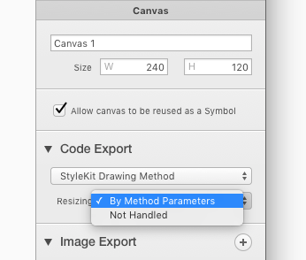

# 缩放绘方法

默认情况下，所有的新画布都会生成携带两个额外参数的绘方法：目标 `'Frame'` 和缩放行为。目标 `'Frame'` 定义了画布在渲染时的可用空间 —— 通常是视图的边界。缩放行为是提供的4个 enum 值之一，它们控制的是在目标 `'Frame'` 内容是符合缩放的。

- aspectFit —— 适应目标 `'Frame'` 同时保留长宽比
- aspectFill —— 填充目标 `'Frame'` 同时保留长宽比
- center —— 在目标 `'Frame'` 同时保持原始大小和中心
- stretch —— 填充目标 `'Frame'` 同时忽略长宽比

新的画布默认会启用这个功能。对于用作 Symbol 的画布，则强制生成缩放参数。否则这个功能就可以在画布设置中打开或关闭。



## Frames

如果你在画布中使用了 Frame 来调整大小，那么就不会生成其他缩放绘图的方法。

## 例子

Objective-c 中 StyleKit 中缩放方法的接口：

``` Objective-c
+ (void)drawTriangle;
+ (void)drawTriangleWithFrame: (CGRect)targetFrame 
                     resizing: (StyleKitNameResizingBehavior)resizing;
```

和在 UIView 子类中的用法

``` Objective-c
- (void)drawRect: (CGRect)rect
{
    [StyleKit drawTriangleWithFrame: self.bounds
                           resizing: StyleKitResizingBehaviorAspectFit];
}
```