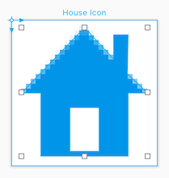
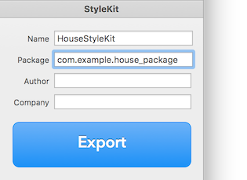
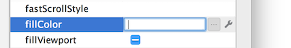

# Android

PaintCode 可以生成在 Android 应用开发中使用的绘图代码。

[▶️PaintCode 安卓代码导出](https://youtu.be/fYpTCR7uW14)

PaintCode 在指定的画布里 生成使用 [android.graphics API](https://developer.android.com/reference/android/graphics/package-summary.html) 来绘制 2D 图像的方法（android.graphics.Canvas）。

以这个房子图标为例：



将生成以下代码：

```bash
void drawHouseIcon(Canvas canvas) {
    // General Declarations
    Paint paint;
    // Local Colors
    int houseIconColor = Color.argb(255, 0, 149, 233);
    // Bezier
    RectF bezierRect = new RectF(2f, 1.5f, 28f, 28f);
    Path bezierPath = new Path();
    bezierPath.moveTo(18f, 18f);
    bezierPath.lineTo(12f, 18f);
    ...
    bezierPath.lineTo(21f, 8f);
    bezierPath.close();
    paint = new Paint();
    paint.setStyle(Paint.Style.FILL);
    paint.setColor(houseIconColor);
    canvas.drawPath(bezierPath, paint);
}
```

这个在各种情况下都很有用。其中之一是实现 View 类的自定义子类。为了使自定义视图绘制房子图标，你可以将该方法粘贴到新的 View 子类中，然后像下面这样重写 `onDraw`:

```bash
@Override
protected void onDraw(Canvas canvas) {
    super.onDraw(canvas);
    drawHouseIcon(canvas);
}
```

## StyleKit

在小型试验中，将代码从 PaintCode 复制粘贴到你的 Android 项目里是没问题的，但实际上效果并不是很好。 对于任何需要在设计和实现之间快速周转的项目，建议使用另一种方法。

PaintCode 生成特殊的 Java 类，我们叫它 StyleKit。它包含了所有的绘方法（有些是多种形式的），还包含了颜色、阴影、渐变和图片的集合，你可以在你的 Android 项目中使用这些方法。

在你第一次切换到 StyleKit 标签时，你需要在检查器中填写名字和包名：



包名会被用在类的头部，同时它还会指定类保存到你的安卓项目中的正确文件夹。将设你的 StyleKit 名字是 HouseStyleKit，然后你的包名是 `com.example.house_package`。

点击导出然后设置主要源目录。

```bash
<Android Project>/app/src/main
```

PaintCode 会自动给包创建文件夹结构，因为它会将你的类保存为：

```bash
<Android Project>/app/src/main/com/example/house_package/HouseStyleKit.java
```

如果你的 StyleKit 使用了位图，那么它们也会被根据它们的像素密度导出到文件夹里。

```bash
<Android Project>/app/src/main/res/drawable-mdpi
<Android Project>/app/src/main/res/drawable-xhdpi
<Android Project>/app/src/main/res/drawable-xxhdpi
```

注意：你只需要选择正确的路径一次。在这之后，每当你再次导出，你的类和位图都会被更新。这也是为什么你不应该手动修改生成的资源。每次导出时，你的更改都会丢失。

StyleKit 使得每次集成只需要几秒钟。在每次修改 PaintCode 文件后，你只需要在 PaintCode 里 按 `⌘R`，然后在 Android Studio 中按 `⌘R`，就可以在测试设备上看到设计的更新。

对前一个使用示例的唯一更改是 `drawHouseIcon` 方法的位置。

```bash
@Override
protected void onDraw(Canvas canvas) {
    super.onDraw(canvas);
    HouseStyleKit.drawHouseIcon(canvas);
}
```

## 参数化绘图

当你的绘图是参数化的时（使用了变量、Frame、参数颜色等），方法签名里包含越多属性，包含的参数就越多。

```bash
public void drawHouseIcon(Canvas canvas, int iconColor) {
   ...
}
```

## 带属性的自定义视图

自定义视图可以被改进，以便在布局中修改它的属性。如果自定义视图被成为 `HouseView`，下面的文件必须进行编辑：

```bash
<Android Project>/app/src/main/res/values/attrs_house_view.xml
```

包含一个属性(让我们称之为 fillColor) :

```bash
<resources>
    <declare-styleable name="HouseView">
        <attr name="fillColor" format="color" />
    </declare-styleable>
</resources>
```

最后，必须更新自定义适度的实现，以便在初始化期间家在属性：

```bash
public class HouseView extends View {
    private int mFillColor = Color.RED;

    public HouseView(Context context) {
        super(context);
        init(null, 0);
    }

    public HouseView(Context context, AttributeSet attrs) {
        super(context, attrs);
        init(attrs, 0);
    }

    public HouseView(Context context, AttributeSet attrs, int defStyle) {
        super(context, attrs, defStyle);
        init(attrs, defStyle);
    }

    private void init(AttributeSet attrs, int defStyle) {
        // Load attributes
        final TypedArray a = getContext().obtainStyledAttributes(
                attrs, R.styleable.HouseView, defStyle, 0);

        mFillColor = a.getColor(
                R.styleable.HouseView_fillColor,
                mFillColor);

        a.recycle();
    }
    ...
}
```

从现在开始，自定义视图有了新的属性 `fillColor`，可以像下面那样用于布局：

```bash
    <view
        class="com.pixelcut.houseproject.HouseView"
        android:id="@+id/view"
        app:fillColor="@color/colorPrimary"
        android:layout_width="wrap_content"
        android:layout_height="wrap_content" />
```

也可以在设计标签中找到：



## 层类型

默认情况下，视图使用硬件层类型。在某些情况下这个类型啃根更快，但它不支持模糊（在阴影中使用）和缩放。所以为了为了使渲染更加准确，你需要将 layerType 属性改为 software。

## Context

如果你使用了位图和自定义字体，StyleKit 需要引用这些文件。在这两种情况里，它都需要一个 `context` 类实例。你需要设置名为 `context` 的静态属性来提供。例如，在活动的初始化时：

```bash
@Override
protected void onCreate(Bundle savedInstanceState) {
    super.onCreate(savedInstanceState);
    setContentView(R.layout.activity_main);
    HouseStyleKit.context = getApplicationContext();
}
```

## Scale

有两种缩放的方法。你可以使用 `resizing drawing methods`。绘方法的缩放变体是同样的绘方法，但是它还有两个参数：目标矩形（类似为 RectF）和缩放行为。`ResizingBehavior` 是StyleKit中定义的枚举类型。这些值是：

- AspectFit
- AspectFill
- Center
- Stretch

这是在参数化 drawHouseIcon 方法中使用这种方法的一个例子:

```bash
HouseStyleKit.drawHouseIcon(canvas,
    targetRectangle,
    HouseStyleKit.ResizingBehavior.AspectFit,
    Color.BLUE);
```

如果你只是想考虑设备的显示像素密度，你可以在调用 drawing 方法之前缩放画布：

```bash
@Override
protected void onDraw(Canvas canvas) {
    super.onDraw(canvas);

    float displayDensity = getResources().getDisplayMetrics().density;
    canvas.scale(displayDensity, displayDensity);

    HouseStyleKit.drawHouseIcon(canvas);
}
```

## Vector drawables

`Vector drawables` 被认为是类似于 SVG 的图片。请参阅 图片导出 部分。
