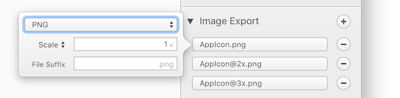
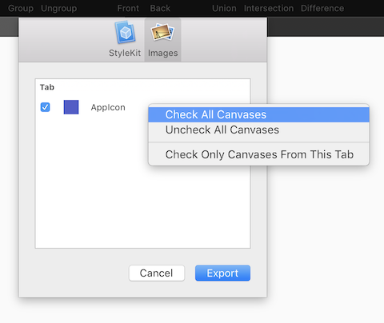

# [图片导出](_cover.md)

Paintcode 的主要用途是生成各种编程语言的绘图代码。但是有时候使用图片而不是绘图代码是有必要而且实用的。图片导出涵盖了这些情况。

可以在检查器中为一个或多个画布设置图片导出。

导出的图片的名字由画布名字、可选的后缀和文件拓展名组成。

## PNG

你可以按照倍率，或者指定特定的长宽来导出画布的大小。点击标签可以在`Scale`，`Width`和`Height`之间切换。

## PDF，SVG 和 Vector Drawable

这些文件是独立于分辨率的，因此没有比例设置。

## 动态 PNG 序列

使用这个选项，PaintCode 可以在改变选定的数字变量的值时，生成多个 PNG 图片。你可以设置生成的图的值的范围和数量。还可以设置缓动。

## Gif

Paintcode 生成的图像与 PNG 动画序列的情况完全相同，但是它们随后会被用作 GIF 动画中的帧。

一旦你为所有画布设置了所需的导出，你可以通过单击菜单栏中 `File / Export / Images` 来导出所有图片。

在这里你可以选择你要导出的画布。
