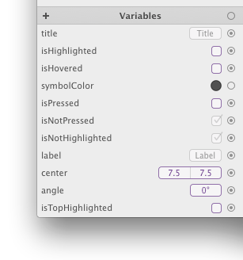

# 变量

就跟颜色和渐变一样，变量也是一种可以在文件中使用的库项。


变量可以是，数字、文字、布尔值（逻辑值）、位置、大小、矩形，甚者是颜色、阴影和渐变。你可以在画布中给你的形状连接变量。



举个例子，你可以创建一个叫 `'radius'` 的数字变量，然后将它连接到多个圆角矩形的圆角属性中。当你改变 `radius` 变量的值，它所连接的形状的圆角就会立即更新！

在画布生成的绘方法中，变量转换为方法参数。

## 创建变量

要新建一个便利那个，只需要点击库中 `Variables` 标题左边的 `'+'` 按钮。紧接着选择你想要创建的变量的类型。


## 修改变量

每当你新建了一个变量，会自动出现一个弹框。你也可以随时双击库中的变量来打开这个弹框。


你可以在这个编辑弹框里更改多个变量的属性，多数情况下都是编辑它的**值**和**名字**。

不同类型的变量有不同的编辑弹框。这是 `rectangle` 变量的：


这里的 `Usage` 属性会影响生成的代码。不过我们只是先提一下，后面再来解释它。

小技巧：你可以不打开编辑弹框的情况下就能编辑大多数变量的值。只需要用鼠标上下拖拽变量列表里数值框。

## 连接变量到形状

有几种可以连接变量到一些形状的属性的方式。第一种方式是，选中画布中的一个或多个形状，然后拖拽变量的连接点到检查器里形状的一个属性上。


或者你也可以直接将一个连接点拖动到画布里的形状上，然后在出现的菜单里选择想要的属性。这个方法通常都比前面那种更方便，不过一次只能够给一个形状连接属性（相比之下，通过检查器来连接，你可以一次性连接一个变量到多个形状）。


要注意，有些属性比如 `'Bezier'` 的控制点位置和一些组属性智能通过检查器来连接。

## 连接指示按钮

当你将一个变量连接到属性之后，通常会在检查器里出现一个连接指示按钮（这个按钮代替了原来的属性文本输入框）。在下面的例子中，我们讲一个变量连接到了一个圆角矩形的圆角半径上。


当你点击连接指示按钮，会出现一个相关弹框。


你可以在这个弹框里设置偏移量 —— 一个当变量被该属性使用时应该添加到该变量值中的值。这个自定义的变量偏移可以大大地减少文件中需要创建的变量数。另外，如果有必要的话，你开可以通过这个连接指示按钮，来将属性切换成另一个变量。

## 取消一个属性的变量连接

要从一个属性中取消变量的连接很容易，只需要点击连接指示按钮上带 `'X'` 图标的紫色圆形按钮。

当你取消了变量的连接，连接指示按钮就会被换成原先的文字输入框：


## 通过使用变量来控制一个形状的可见性

你可以使用一个布尔变量来控制一个形状的显示和隐藏。在形状的检查器里，在名字输入框正下方是一个可以控制形状的可见性的弹出按钮。


点击它后弹出一个菜单，上面会列出你 PaintCode 文件里所有的布尔值变量。


在上面的例子里，我们的文件里包含了一个叫 `'isPressed'` 的布尔值变量。通过选择 `'Visible  if isPressed'` 选项，我们就可以确保当 `'isPressed'` 变量为真时，形状才可见。

## 在画布中显示的变量

当你创建了一个 `'point'` 或 `'rectangle'` 变量，然后将它连接到画布中的一些形状里，那么变量本身也会现在是在画布上，用紫色表示。


对于 `'point'`,它是一个你可以随意拖动的小小的靶子图标 —— `'point'` 变量的值会相应地改变。`'rectangle'` 变量也是类似的。

这里举个例子，当你创建了一个代表鼠标指针的 `'point'` 变量时这个功能就很有用了。你可以通过表达式来创建许多依赖于 `'point'` 变量的变量，然后只需要拖动这个`'point'` 变量，你就可以轻松地测试目标行为。

你可以在菜单栏中选择 `'Canvas ▸ Show Variables'` 来关闭或打开这个功能。


## 变量与代码生成

在由画布生成的绘方法中，变量会转换成参数：

```objective-c
- (void)drawRateButtonWithRadius: (CGFloat)radius title: (NSString*)title pressed: (BOOL)pressed;
```

除非你在变量设置弹框中将变量设置成本地的。注意，表达式变量都是本地的。


## 表达式

你可以在在 PaintCode 中创建一个特殊类型的变量 —— 表达式。这种变量可以通过 数学和逻辑表达式来定义它的值。它们可以依赖于其它变量甚至其它库项（比如颜色）。


我们实际上在 PaintCode 中添加了一个很小巧的编程语言。它是一个 `C` 和 `JavaScript` 的子集，并且非常容易使用。
 
通过表达式变量，你可以创建真正复杂的动态绘图，甚至是游戏中的动画形象。


当你的表达式里出现黄色的底色，就意味着它出错了。你可以通过点击表达式里的黄色部分，或者编辑弹框左下角的警示三角形。


表达式不仅限于数字 —— 你可以使用逻辑运算符，比如`'C'`里很流行的 `'?:'` 三元运算符，你甚至可以从库中查询颜色来创建新的。

重要：库项（比如颜色）的名字中如果含有空格是不合语法的。

不过，如果你想要在表达式中通过库项的名字来引用它，你需要去掉空格，将每个单词首字母大写，第一个字母小写。比如，如果你库里面有个叫 `'My Red Color'` 的颜色，你可以写成 `'myRedColor'` 来在表达式中引用它。

要了解更多关于 PaintCode 表达式语言，请到下一节。
