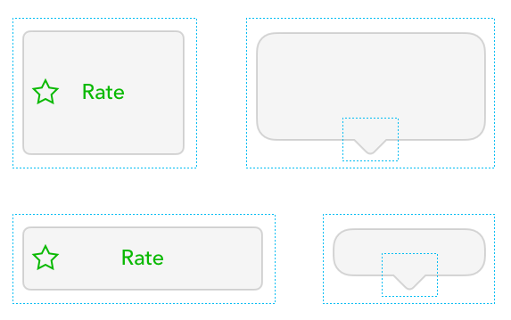
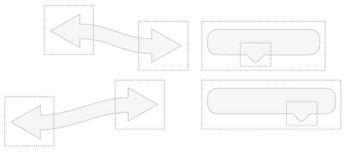
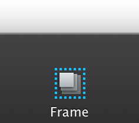
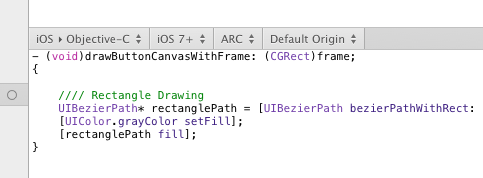

# [动态形状](_cover.md)

[▶️动态形状](https://youtu.be/-R5De4v75iA)

PaintCode 有个非常好的功能叫 **动态形状**。通过它你可以定义形状缩放的时候的行为，然后这个动态行为在生成的代码里会被编译。

`'frame'` 和 `constraint` （框架和约束）在除了调整大小之外还有着更广泛的用途。你可以通过它们以许多有趣而且有用的方式来改变形状：

要使用动态形状：

- 在形状周围画一个 `Frame`
- 定义当包围形状的 `Frame` 在调整大小时，形状的行为
  
当然，一个 `Frame` 可以包含多个形状。

## Frame，框架

要创建一个 `Frame`，只需要从工具栏里选择它的图标，然后在画布里拖拽。

`Frame` 不是形状。它们自己本身不绘任何东西。但是他们会影响生成的代码。而且还会影响它包含形状的动态行为。

在生成的代码中，一个 `Frame` 对应一个方法参数：

动态形状从包围它的 `Frame` 里推导出它的大小和坐标。

当你在画布中缩放一个 `Frame`， 所以相关的形状也会被缩放/移动。要抑制这个表现，在移动的同时按住 `Command` 键。
