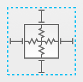
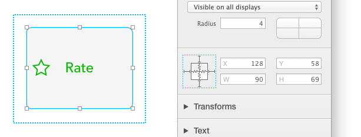
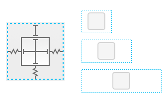
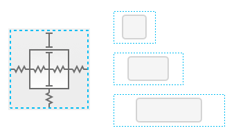
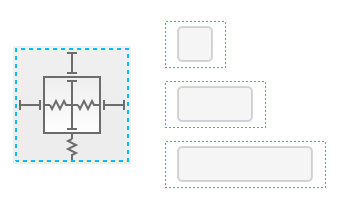
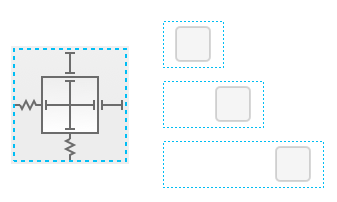
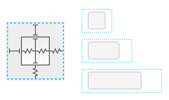

# [缩放约束条件](_cover.md)

你可以定义一个形状的缩放行为，通过使用检查器里的缩放约束条件：

这个约束条件定义了一个形状和它的 `Frame` 间的关系。有六种约束条件：left, right, top, bottom, width 和 height。

在定义形状和它的 `Frame` 间的关系时，水平的约束条件（left, width, right）是完全独立于纵向的。为了清晰起见，下面例子中我们将只描述水平约束条件的行为。

每个约束条件既可以是固定的，也可以是拉伸的（ `rigid`和`flexible`）。

左边的约束代表形状的左边和包围它的 `Frame` 的左边的距离。当左边的约束是固定的，那么无论你怎么调整 `Frame` 的大小，这个距离都不会改变。而当这个左边的约束是拉伸的，那么 PaintCode 会根据另外两个（width，right）条件来尽量让这个距离相应变大。

`width` 和 `right` 约束也是类似。你可以通过固定和拉伸条件的特定组合，来实现各种有用的行为。

## 将固定宽度的形状居中

使形状按比例调整大小

两边有固定边距的形状

吸附到右边的形状

吸附到左侧而且大小成比例变化的幸好组啊姑娘

