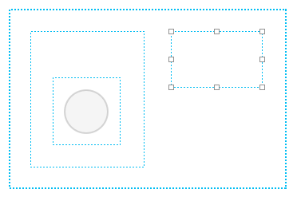
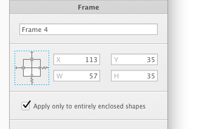

# [Frame 和 形状的层级结构](_cover.md)

- 你可以在 `Frame` 中嵌套 `Frame`
- `Frame` 也可以调整大小约束

PaintCode 会根据 `Frame` 的大小和位置自动给你创建 `Frame` 的层级结构。默认情况下，所有被全包含或部分包含在某一个 `Frame` 下的形状就属于那个 `Frame`。

在某些情况下，`Frame` 可以选择只影响被他完全包围的形状。你只需要在 `Frame` 的选择器里将 `Apply only to entirely enclosed shapes` 复选框勾选上：

如果一个形状属于多个 `Frame`，那么其中最小的那个会被用作它的参考。
