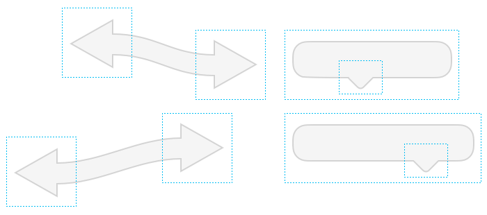

# [动态 Bezier](_cover.md)

对于像矩形和椭圆这类简单的形状，使用**缩放约束条件**来指定他们的缩放行为就很有效了。不过对于 `bezier` 你需要一个更好的方式来控制它。

区别在于：

- 你可以定义 `bezier` 单个点的**缩放约束条件**
- 不同的控制点可以依赖不同的 `Frame` （ `bezier` 没有单独的参照`Frame`）

由于控制点没有宽高，所以它的约束条件控制就相对简单：

![控制点]](./images/controlpointconstraints.png)

可以设置4种约束：left, right, top, bottom。每一个都可以是固定的或者是拉伸的。

当左边的约束设置为固定的，控制点就会相对于它参照 `frame` 的左边缘保持固定距离。类似的，当右边的约束是固定的，控制点就会相对于它参照 `frame` 的右边缘保持固定距离。

当控制点的左边和右边的约束都是拉伸的，它就会在它的参照`frame`内保持相同的相对位置。举个例子，假设你的 `Frame` 宽度是 300，控制点距离 `Frame` 左边 100。当你将 `Frame` 宽度调整为 600，那么控制点距离 `Frame` 左边就会变为 200。

控制点的左右约束条件不能同时设为固定。

可以通过给单个控制点设置设置缩放约束条件来做出复杂的缩放效果。此外，由于你可以使用多个 `Frame` （甚至是嵌套的 `Frame`），要创建有趣的效果时就很简单了。

