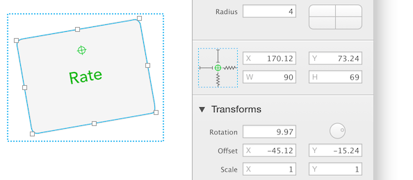
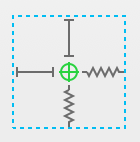

# [动态形状和变换](_cover.md)

一旦你的形状设置了 `变换` 效果，就不能像前面的内容里说的那样设置它的缩放约束条件了。

不过在这种情况下，你还是可以指定形状变换原点的位置行为的。举个例子，这样你就可以将一个旋转了的形状摆在它的 `frame` 的中间，虽然你已经不能购修改它的宽高了。

这种情况里，缩放控制看起来不一样了 —— 中间变成了一个绿色变换原点的图标：

当一个变量连接到形状的变换属性里时，也会有同样的限制。
