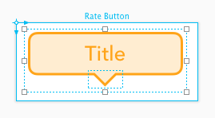
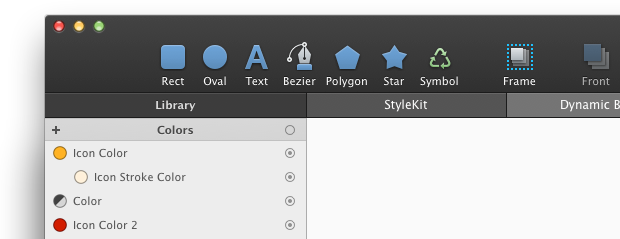
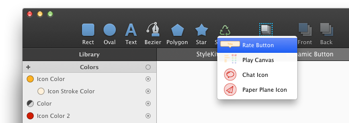
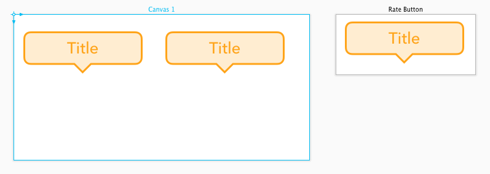
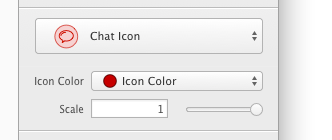
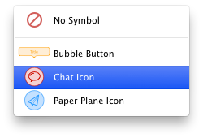
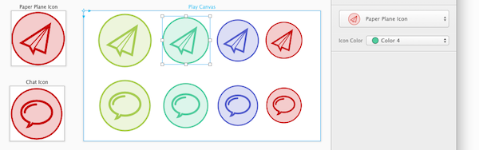
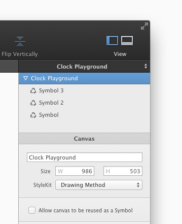

# Symbol

通过 `Symbol` 你可以轻松地在整个文件里复用你的绘图。当在设计整个界面的原型时这个功能尤其有用。

举个例子，你可以在一个画布里画一个按钮，然后在其它画布上复用这个按钮。你可以随时调整原画布，然后所有的改变会在所有的 `symbol` 里自动生效。

## 使用 Symbol

Symbol 的使用非常简单。首先，在你的画布上画点东西。可以是图标，可以是 UI 控件或者是其它任何你想要复用的绘图。

接着选择另一个画布，然后在工具栏里选择 `Symbol` 图标，就会出现一个包含所有可用 `Symbol` 的菜单。

从中选择你想要使用的 Symbol。接着在画布中单击来放置 Symbol。

Symbol 和其它形状比如矩形和椭圆类似 —— 你可以随意拖动它，改变它的大小，设置变换等等。

你可以在 Symbol 检查器里的弹出按钮上更改画布里所使用的 Symbol。在下图中，画布里使用了 `Chat Icon`：

## Symbol 是动态的

即使一个 Symbol 被使用了，你可以随时调整原画布，然后所有的改变会在所有的 `symbol` 里自动生效。

## 参数化的和可缩放的 Symbol

相较于 Mac 平台上任何绘图软件，PaintCode 对 Symbol 有着最好的支持。为什么？ PaintCode 的 Symbol 是可缩放的和参数化的。

如果你在画布中使用了 **Frame**，你将它作为 Symbol，然后这个 Symbol 就可以根据你所指定的 缩放约束条件 来进行缩放。

另外，你在 Symbol 画布中所使用的变量，都可以在 Symbol 的检查器里作为可编辑的参数访问。

例如，你可以创建了一个基于 `Pressed`  变量来改变自身设计的按钮。当你把这个画布做成一个 Symbol，在 Symbol 检查器里会出现一个叫 `Pressed` 的复选框。

如果你将你的颜色、渐变、阴影和图片的行为设置为参数，它们也会变成 Symbol 检查器里可访问可编辑的参数。这是一个非常强大的功能 —— 比如，你可以根据这个设计 icon，当成 Symbol 多次引用它，每次都可以给这个 icon 指定一个不同的颜色名字。

最后，Symbol 也可以嵌套，意思就是你可以在 Symbol 中使用 Symbol。

## 将一个画布设置为不可作为 Symbol

默认情况下，你文件中所有的画布都可作为可复用的 Symbol。意思就是他们全都会在你的 Symbol 工具菜单里出现。

如果你想让某些画布不出现在这里，你可以通过它的标题选中画布，然后在右边的检查器里将 “Allow canvas to be reused as a Symbol” 这个复选框取消勾选。

## 代码生成方面的考虑

Symbol 和生成代码中的方法调用相对应。

但有一种情况是不支持的：使用嵌套 Symbol 中的文本，这些 Symbol 使用了 Y 轴翻转不一致的画布。这种情况下，当你运行生成的代码时，文字可能会上下翻转。
