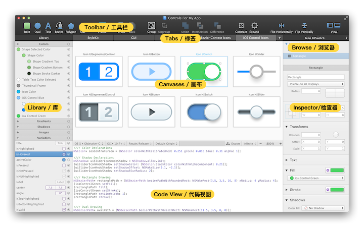
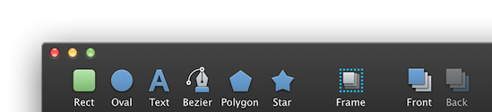
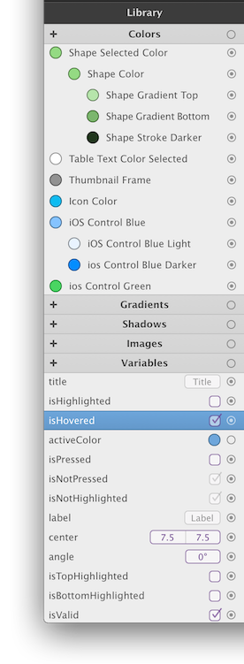
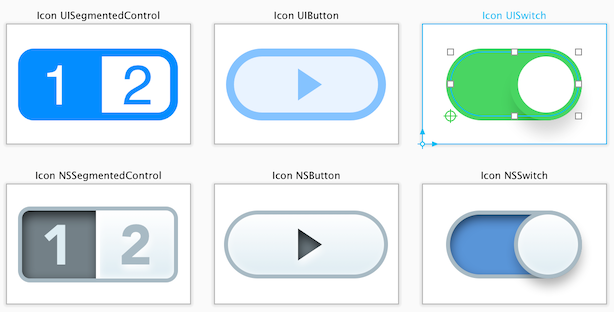
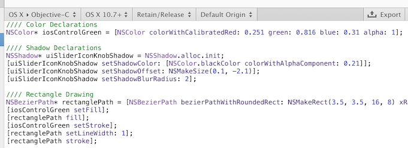
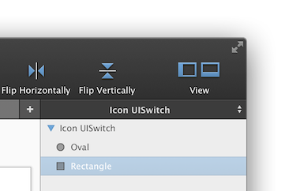
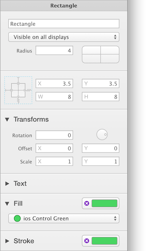

# [概述](_cover.md)

PaintCode 是一个可以将你的绘图实时转换成 Objective-C、 Swift 和 C# 绘图代码的矢量绘图软件。它的应用程序窗口被划分成了 4 个部分，便于快速地找到你需要的所有功能。

## 工具栏

窗口顶部的**工具栏**包含了你会经常使用的绘图工具。

## 标签和 StyleKit

标签栏位于工具栏下方的中间位置。你可以使用标签来管理你 Paintcode 文件中的绘图。每个标签页都可以包含多个绘图画布。

第一个标签比较特殊，叫 **StyleKit**，你可以在这里找到你的 Stylekit 目录 —— 一个绘图、颜色、渐变和其他设计资源的集合，你可以轻松地将它导出成一个单独的 Objective-C、 Swift 或 C# 类。Stylekit 让你轻松地将生成的代码集成到你的项目中。

## 库

库（窗口左侧）是所有颜色、渐变、阴影、图片和变量的集合。库里边所有的项都可以在文件中重复使用。库项在 PaintCode 中是独立的实体，当你改变了一个库项，所有使用到它的绘图都会立即收到影响。

> Tovi注：库项，英文为 library item。指的是窗口左侧的 库 中那些颜色、渐变等元素。因为这个词汇在文档的后面也会提到多次，但是在中文中我并没有听过 库项 这个词，所以还是有些迟疑的。不管怎么说，在没找到更好的翻译之前，先用着 库项 这个翻译。

## 画布

软件窗口的中间部分包含了当前选中的标签的内容。通常你会在这个区域看到一个或多个绘图画布。

## 代码视图和中间工具栏

你可以在**中间工具栏**那里更改代码生成设置（比如目标程序语言和操作系统版本）。你也可以在这里更改**画布显示设置**，如缩放和像素密度（Retina、non-Retina 或无限模式）。

在这个工具栏的下方是**代码视图**，包含了生成的代码。你可以通过拖动中间工具栏来隐藏代码视图，这样你就可以有更多的空间来显示你的绘图画布，而且当在处理比较复杂的文件的时，还可以通过这种方式来优化软件性能。

## 形状和组浏览器

**形状和组浏览器**位于窗口的的右上方，就在工具栏的下面。这是当前选中画布中所有**图形**的列表。你会发现画布也本身位于这个列表的根目录里。当你选中一个画布时，它的相关设置会出现在它下方的检查器里。

## 检查器

检查器在窗口的右边。你可以在这里更改所选对象的属性，通常就是指画布里的图形。

