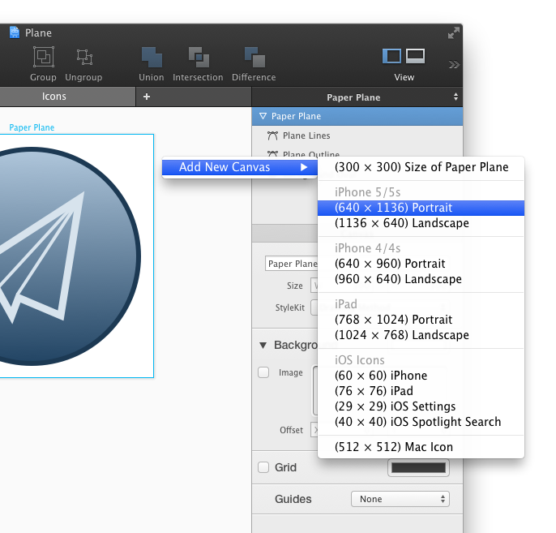
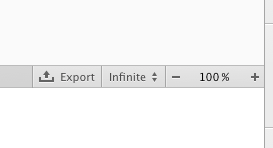
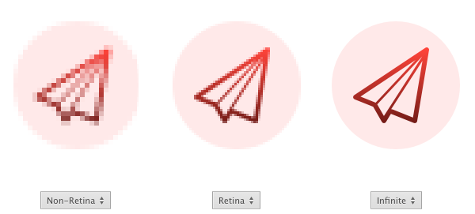

# [使用画布](_cover.md)

画布是你用来创建你的绘图的地方。每一个画布都会生成单独的绘方法。

## 移动画布

拖动一个画布的标题来在工作区内移动它。每个画布的标题都显示在它的顶部中间。

## 调整画布大小

首先在工作区里选中一个画布的标题。然后拖动画布的边缘来缩放它。

或者，你也可以在检查器里设置画布的大小。

## 添加画布

在 PaintCode 里，你可以在同一个标签页里放多个绘图画布。要添加一个新的画布，你可以使用应用程序菜单 `'Canvas ▸ New ▸ Default'`，或者按 `'Shift +  Command + N'` 快捷键。

或者你可以在标签页里的空白位右键件调出菜单，然后从里边选择：

## 移除画布

首先在工作区里选中一个画布的标题，然后按 `'Delete'` 或 `'Backspace'` 键。

## 缩放画布

- 按 `'Command'` + `'+'` 来放大
- 按 `'Command'` + `'-'` 来缩小

在触摸板上，也可以用 Pinch 手势来缩放，或者，你可以按住 `'Option'` 键然后使用两只手指纵向滑动（或滑动鼠标滚轮）来缩放。这种方式会以鼠标指针的位置为中心，所以你可以轻易地直接缩放到画布的任意位置。

你还可以使用中间工具栏上的缩放控制。

画布创建菜单里的第一项可以帮你轻松地创建一个和当前激活画布的大小一样的画布。

## 随意移动画布

你可以使用滚动条或者在触摸板上使用两只手指来移动画布。

或者，你可以按住 `'Space'` 键然后拖拽鼠标来移动画布。

另外，你还可以使用 `'Preview'` 来导航画布。

当你点击 Preview 中的一个点时，画布也会按照那个点居中。你甚至可以在 Preview 里进行拖动来平滑移动画布。

## 画布显示模式

PaintCode 有四种不同的的模式来渲染你的绘图：

- 1x 的 non-Retina 模式
- 2x 的 Retina 模式
- 3x 的 Retina 模式
- 无限模式

你可以在中间工具栏里来切换这几种模式。你还可以使用 `'Option'` + `'D'` 快捷键来切换。

non-Retina 模式展示的是你的绘图在 non-Retina 显示器上的样子（大多数Mac），Retina 模式展示的是你的绘图在  Retina 显示器上的样子（大多数 iOS 设备）。最后，无限模式则会用无限的精度来预览你的绘图 —— 无论你放到多大，绘图都不会像素化。

## 画布显示模式的重要性

画布显示模式的选择并不会影响到最终生成的代码。生成的代码不会与分辨率相关，而且在任何显示器上都能完美适配。我们设计这些模式主要想在你绘图的时候帮到你。

如果你的绘图能够对齐 non-Retina 模式中的像素网格，那么就可以 100% 保证你的绘图 在高像素密度的显示器里也能够保持清晰。也就是说，如果你是用 Retina 模式或这无限模式，有可能你画的图在 Retina 模式下看起来很清晰，但是在 non-Retina 设备上就模糊了。

由于这个原因，你应该默认使用 non-Retina 显示模式，然后在特定情况下来 切换到 Retina 或 无限模式来查看你画的图在更高像素密度中看起来效果怎样。
