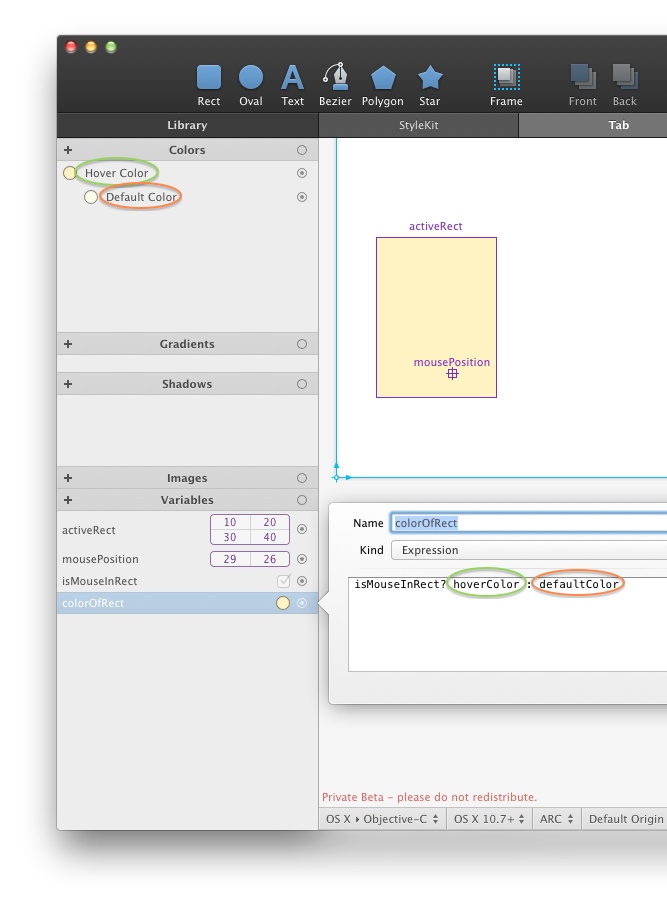

# [表达式语言](_cover.md)

在 PaintCode 里，你可以使用我们简单的表达式语言来定义依赖于其它变量的变量。它支持许多的数学计算、逻辑函数和许多程序员期待的运算符。它的语法是 `C` 和 `JavaScript` 的子集，非常简单。

[▶️变量和表达式](https://youtu.be/Shu5gqfJOWw)

只需要创建一个类型为 `'expression'` 的新变量，并将表达式写入文本框。新变量的值会被自动计算和更新。

在你导出了 PaintCode 文档后，这些变量表达式会被转换成你所选择的编程语言（Objective-C，Swift，C#，JavaScript 和 Java）。它们定义的变量之间的计算和动态关系在导出的代码里会继续起作用。

## 变量类型

### Numbers

PaintCode 中所有的数字都是浮点型。以下的表达式会返回数字：

```bash
5
```

```bash
5 * 4 + 3 * 2
```

你可以轻松地在表达式里引用其他变量。这个语言还有一些内置的函数可以调用：

```bash
width * (4 - offset)
```

```bash
sin(2.7 / PI * 180)
```

```bash
sqrt(width * width + heigt * height)
```

### Texts

文本变量是无限长度的字符串。你可以使用单引号或者双引号作为文本限定符：

```bash
"This is text!"
```

```bash
'This is also text, now using single quotes.'
```

文本可以使用 `'+'` 运算符串联。数字也可以通过使用 `stringFromNumber(x)` 函数转为文本。

```bash
"angle: " + stringFromNumber(180)
```

你可以使用 `dot-notation` 来获取文本的宽度（字母数量）。这个会返回一个数字。

```bash
"Hello".length
```

### 布尔值

布尔变量通常被用来表示逻辑值 —— 是或否。 或者你也可以使用常量（YES, yes, No, no）。

比较的结果都是布尔型的。返回布尔值的表达式的例子：

```bash
true
```

```bash
3 > 2
```

```bash
"hello" != "world"
```

```bash
mousePosition.x >= activeRect.x &&
mousePosition.y >= activeRect.y &&
mousePosition.x <= activeRect.x + activeRect.width &&
mousePosition.y <= activeRect.y + activeRect.height
```

你还可以使用三元运算符 `?:` 来返回两个值中的一个，具体取决于第一个参数的值。第二个和第三个参数必须是相同类型的（在这个例子中是文本类型）：

```bash
isValid ? "Valid" : "Invalid"
```

### Point，点

点，使用 `makePoint(x,y)` 函数来创建新的点：

```bash
makePoint(10,20)
```

让我们假设你有个叫 `myPosition` 的点变量。并且希望在表达式中使用这个点的 `x` 坐标。就可以像这样：

```bash
myPosition.x + 100
```

下面是如何计算 `positionA` 和 `positionB` 中间的点：

```bash
makePoint((positionA.x + positionB.x) / 2,
          (positionA.y + positionB.y) / 2)
```

### Size，大小

大小和点类似。它也包含两个数，但是他们是宽和高。它们的用途是表示矩形的大小。

```bash
makeSize(10, 20)
```

假设你已经定义了一个名为 `defaultSize` 的 `size` 变量和一个数值变量 `zoom`。现在你想通过因子 `zoom` 放大它的宽度来获得一个新尺寸。

```bash
makeSize(zoom * defaultSize.width, defulatSize.height)
```

### Rectangle，矩形

`rectangle` 变量包含 4 个数字： `x, y, widht, height`。有一个用来创建矩形的值的函数叫 `makeRect(x, y, width, height)`. 其中 `width` 和 `height` 表示矩形的大小， `x` `y` 表示它的原点。

```bash
makeRect(0, 0, 640, 1136)
```

让我们假设你有一个叫 `iPhoneBounds` 的矩形 `rect`。你不仅可以轻易地获取到每一个值（x, y, width, height），你还可以获得到它的大小和原点。

```bash
iphoneBounds.size
```

以下两个表达式是等价的：

```bash
iphoneBounds.origin.x + iphoneBounds.size.width
```

```bash
iphoneBounds.x + iphoneBounds.width
```

### 颜色

颜色由四个数字组件表示：红色、绿色、蓝色和透明。每个组件都取自区间 `'1'`。可以用 `makeColor(r, g, b, a)` 函数来创建颜色。下面这个表达式返回纯黄色：

```bash
makeColor(1, 1, 0, 1)
```

你在库中定义的颜色也可以被用在表达式里（比如，要根据按钮是否点击来返回两个颜色中的一个）。不过，在表达式里引用颜色（渐变、阴影等库项也一样）的时候要小心。它们的命名比较随意，但是变量的名称是有限制的：

- 只允许使用英文字母、数字和下划线字符
- 只有变量名字的开头使用小写

你的颜色名可能会包含空格和符号（比如 'Dialog Background Color'）,但是在脚本中引用他们的时候，使用 "净化" 过的形式，就像下面例子中所示：



更多例子：

|  原始名字           | “净化”的名字  |
|  ----             | ----  |
| myColor           | myColor |
| Bézier Color      | bezierColor |
| button-background|buttonbackground |
|button_background | button_background1|
| $a%#^(4)@| a4|
| Extrémité|extremite |

### 渐变

要创建一个 `'2 step'` 两段渐变，使用 `makeGradient(color1, color2)` 函数。

```bash
makeGradient(makeColor(1, 0, 0, 1),
             makeColor(1, 0, 0, 0))
```

或者，如果你已经有两个颜色了，那么你可以：

```bash
makeGradient(solidRedColor, transparentRedColor)
```

### 阴影

要创建阴影，使用 `makeShadow(color, offsetX, offsetY, blur)` 函数。

```bash
makeShadow(solidRedColor, 5, 5, 3)
```

## 运算符

按照优先级排列的运算符：

| 运算  |   类型   |       结果     |
| ---- | ---------| ----------     |
| !b   |  boolean |    b 的逻辑非    |
| x * y| numbers| 数字 x 和 y 的乘积|
|x / y | numbers|  数 x 和 y 的商  |
|x % y | numbers|  进行 x 和 y 除法后的余数; 模数 |
| m + n|字符串 |文字 m 和 n 串联   |
| x + y|numbers | x 和 y 的和  |
|x - y | numbers| x 减 y  |
| x > y| numbers| 如果 x 大于 y 则为真，否则为假  |
|x >= y | numbers| 如果 x 大于等于 y 则为真，否则为假   |
| x < y| numbers|  如果 x 小于 y 则为真，否则为假 |
| x <= y| numbers| 如果 x 小于等于 y 则为真，否则为假  |
|a == b | 同类型|  如果 a 等于 b 则为真，否则为假 |
| a != b| 同类型| 如果 a 不等于 b 则为真，否则为假  |
|a && b | 布尔值| 如果 a 和 b 为真则为真，否则为假  |
| a `||` b| 布尔值| 如果 a 和 b 为假则为假，否则为真   |
| b ? x : y| 布尔值| 如果b为真，那么结果为 x， 否则结果为 y |

## 常量

- 布尔常量：yes, no, true, false, YES, NO
- 数字常量：PI
- 颜色常量：MISSING_COLOR
- 渐变常量：MISSING_GRADIENT
- 阴影常量：MISSING_SHADOW
- 图片常量：MISSING_IMAGE

## 基础数学函数

- `floor(x)`：返回 x，向下取整
- `ceil(x)`：返回 x，向上取整
- `round(x)`：返回 x，四舍五入
- `frac(x)`：返回 x 的小数部分
- `sqrt(x)`：返回 x 的平方根
- `abs(x)`：返回 x 的绝对值
- `min(x, y)`：返回两个参数中较小的一个
- `pow(x, y)`：返回 x 的 y 次方
- `log(x)`：返回一个数字的自然对数
- `log2(x)`：返回一个数的以2为底的对数
- `log10(x)`：返回以10为底的对数

## 测角函数

- `sin(a), cos(a), tan(a)`：goniometric functions.Note: parameter a should be in degrees
- `atan2(y, x)`：arc tangent in degrees of y/x based on the signs of both values to determine the correct quadrant

## 颜色、渐变和阴影

- `Makeccolor (r，g，b，a)`：returns color with components r, g, b, a (red, green, blue, alpha). All parameters should be from interval 0..1
- `makeGradient(c1, c2)`：returns two step gradient with colors c1 and c2
- `makeShadow(color, xOffset, yOffset, blurRadius)`：returns shadow

## 其他函数

- `makePoint(x, y)`：returns point
- `makeSize(width, height)`：returns size
- `makeRect(x, y, width, height)`：returns rect with position of origin (x, y) and size (width, height)
- `stringFromNumber(x)`：converts number x to text
